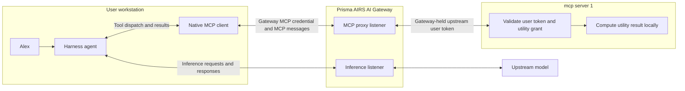
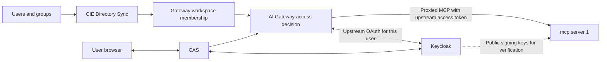

## Two paths through AI Gateway

The architecture is easier to hold as two request paths than as a list of products, so start with the path Alex's question takes. Prisma AIRS Harness sends both inference and remote MCP traffic to Prisma AIRS AI Gateway. The harness contains the agent and the native MCP client, so both paths originate on Alex's workstation. The gateway connects to the model on one path and to **mcp server 1** on the other.

mcp server 1 is a separately deployed service. Its tools calculate, format, transform, encode, hash, generate identifiers and report time, and they execute on that server without downstream API calls. The word "local" in this course describes where those operations run: on the MCP server, not on the user's laptop.

Read the diagram as one cycle. The model proposes a tool call in its inference response. The harness does not execute that proposal itself; it sends the call to the gateway MCP endpoint. The gateway authenticates the caller and proxies the request to mcp server 1. The server then checks its own authorization contract, validates the arguments and performs the operation. Results return through the gateway to the harness, where they can enter the next inference request. A single question can therefore cross the gateway several times, and each crossing is a separate authorization decision.

The two listeners may have different hostnames. Both belong to the gateway deployment, but each has its own credential contract, which is the reason to keep them apart in your model. A workspace API key, for example, is an alternative inference credential. It is not the user's MCP OAuth credential and would authorize nothing on the MCP path.

## Identity remains part of the architecture

A calculator is still an authenticated service in this system, and the identity chain behind it has more than one link. CIE directory membership and CAS login determine whether Alex can reach the gateway at all. Reaching the gateway does not by itself produce the token that mcp server 1 accepts; the gateway obtains that user token separately.

Tool execution needs no management API or service-account token, so there is no downstream credential to protect on that side. Authentication is a different matter: verifying a signed token can still require DNS and retrieval of the issuer's public signing keys. Those requests support identity verification, not a tool's calculation, and keeping the two apart is what lets you say precisely what "no downstream API" means.

## Component ownership

| Component | Owns |
| --- | --- |
| Harness | Conversation, local tools, inference requests, native MCP client and native credential storage |
| Keycloak | Organizational authentication, inference tokens and upstream MCP user tokens |
| CIE and CAS | Directory context, federation and the gateway-facing identity join |
| AI Gateway | Inference routing and checks, MCP proxy access, upstream OAuth credentials |
| mcp server 1 | Utility authorization, input validation and local execution |

Ownership also sets the release boundaries. Updating the harness does not deploy mcp server 1, and updating the server's tool list does not change where the harness sends MCP traffic. Each component has its own delivery and validation evidence, so a passing check on one says nothing about the others.

Continue with [Login](./login.md), [MCP utility tools and authorization](./mcp.md) and [Implementation status](./evidence.md).
