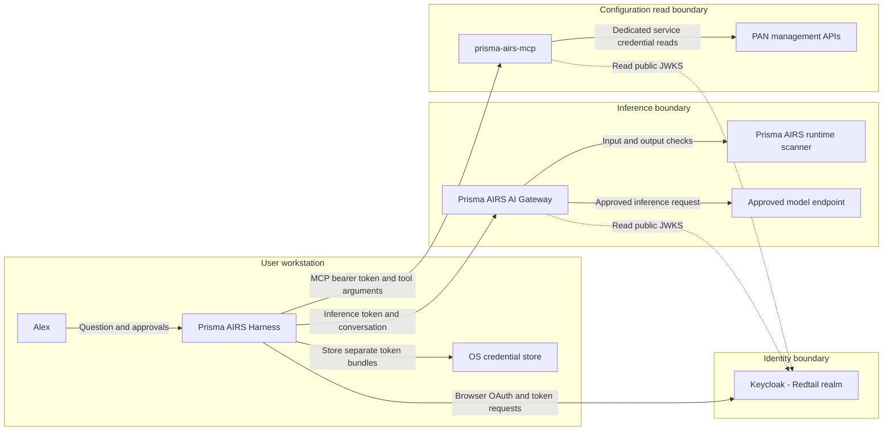
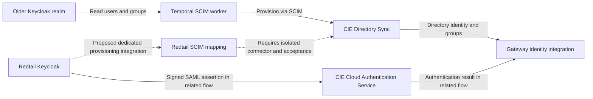

## One assistant, several responsibilities

The harness coordinates work locally. It sends a conversation and tool definitions to the gateway, receives a model-selected function call, then calls the MCP server itself. The model proposes an action; the receiving service still decides whether Alex may perform it.

This diagram describes the implemented harness paths. Arrows label requests or trust relationships. A dotted JWKS arrow means public signing-key discovery; it does not carry Alex's password or refresh token.

The MCP server reads gateway configuration through management APIs. It does not send those requests to the gateway's `/v1` inference endpoint. The AIRS scanner evaluates content. Reading a security profile through MCP does not execute a scan.

## Where Cloud Identity Engine fits

CIE has a directory role and an authentication role. Those functions are shown below as an adjacent identity integration. The reviewed SCIM worker targets the older Truffles realm. A separate Redtail CAS mapping exists for the related Truffles gateway OAuth flow. Matching these identities and connecting the Redtail harness population to the directory is an explicit integration task.

The dotted arrows in this second diagram denote proposed work. They do not claim that the harness currently requires CIE to obtain its native OAuth tokens. CIE is part of the wider identity architecture without being an inline dependency of every request. See [Cloud Identity Engine and provisioning](./cie.md) for the evidence boundary and mapping problem.

## Four different boundaries

| Boundary | Purpose | Example artifact |
| --- | --- | --- |
| Identity | Establish a user and issue grants | Keycloak access token |
| Inference | Select a model route and apply content policy | Gateway config and scan verdict |
| Tool authorization | Permit a bounded configuration read | Subject-to-workspace binding |
| Operations | Deliver code, policies, and server secrets | Image digest, ConfigMap, ExternalSecret |

The operational plane configures the other boundaries. A CI runner builds an image; it does not need a human refresh token. The user selects a tool; the user does not receive the MCP server's PAN service-account secret.

## Check your understanding

If CIE provisioning is delayed, must a valid direct MCP request stop working? **No.** The implemented server evaluates its configured issuer, token, roles, scopes, and resource binding. A gateway route that depends on synchronized CIE membership may behave differently. Name the actual consuming service before drawing a dependency.

Implementation basis: [Implementation status and public sources](./evidence.md). Product context: [Prisma AIRS AI Gateway documentation](https://docs.paloaltonetworks.com/ai-runtime-security/administration/configure-ai-gateway).
