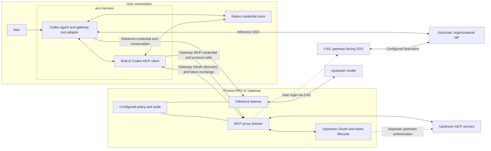
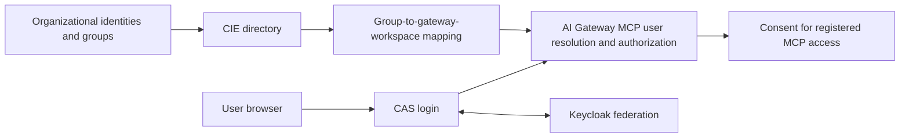

## Required architecture: both paths traverse AI Gateway

Prisma AIRS Harness must use Prisma AIRS AI Gateway as the destination for both inference and remote MCP traffic. Its built-in Codex MCP client connects to the gateway's MCP listener. The gateway connects to upstream MCP servers. A direct connection from the harness to an upstream server does not meet this contract.

The September 13 implementation plan diverged from this requirement by choosing a direct MCP connection. Earlier versions of this course described that implementation as the accepted architecture. That was incorrect. The diagram below states the required architecture; the complete gateway-mediated harness flow still requires its own acceptance evidence.

Inference and MCP may use different hostnames or ports belonging to the same gateway deployment. Sharing the gateway does not require sharing a token: each listener validates the credential and permissions configured for that resource. Workspace API authentication is an alternative inference mode; a workspace API key is not a Keycloak JWT.

The model proposes a tool call through the inference path. The harness dispatches the actual MCP call to the gateway MCP listener. The gateway applies its MCP controls and proxies to the registered upstream. Results return through the gateway to the harness and enter the next inference request. The tool-schema compatibility adapter affects inference serialization; it does not proxy MCP traffic.

## Authentication has two legs

| Leg | Responsibility | Credential location |
| --- | --- | --- |
| Harness → AI Gateway | Authenticate and authorize the human for gateway resources | Harness native store holds gateway-facing credentials |
| AI Gateway → upstream MCP | Complete the configured upstream OAuth flow and renew upstream tokens | Gateway-managed upstream credential storage |

The vendor calls CAS the gateway-facing OAuth authentication method in SCM deployments. CAS federates to the organization's IdP and resolves a provisioned user. Separately, the gateway's upstream OAuth integration handles consent and tokens for an external MCP server. These are both part of the gateway-mediated experience; they must not be collapsed into a direct harness login to the upstream server. See [OAuth in SCM](https://portkey.ai/docs/product/mcp-gateway/authentication/cas) and [MCP authentication layers](https://portkey.ai/docs/product/mcp-gateway/authentication).

## CIE and CAS are part of the required login design

This is a required integration dependency for the CAS route. Existing records about another realm or workspace do not prove this harness workspace is provisioned correctly. Verify the selected directory, authentication profile, identity attribute and workspace membership against the deployed gateway. [CIE Directory Sync](https://portkey.ai/docs/product/enterprise-offering/org-management/directory-sync/cie-directory-sync).

## What remains reusable, and what must change

The built-in Codex MCP transport, local tool dispatch and gateway inference adapter remain useful. A read-only Prisma AIRS MCP server can remain an upstream service. Its deployment does not make it the harness's permitted destination.

The direct-server onboarding commands and direct-path release acceptance are superseded. Correct acceptance must observe the harness talking to the gateway MCP listener, the gateway contacting the upstream, successful authorized reads, gateway denial of forbidden operations, and separate credential lifecycle behavior. A direct read or a scan on a later inference request is insufficient.

Continue with [Login from browser to authorized tools](./login.md) and [Implementation status and public sources](./evidence.md).
