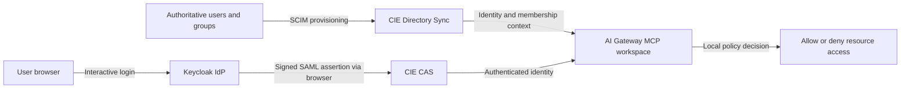
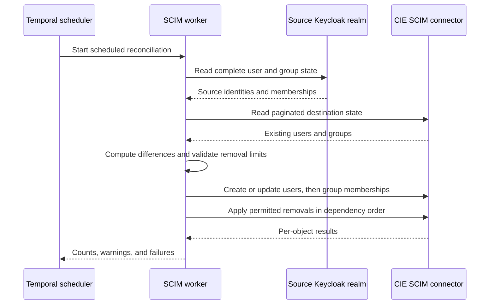

## Two jobs inside CIE

Start with a situation that shows up in the running example. Alex signs in through the browser, Keycloak accepts the password, and the gateway still answers that Alex has no access to the workspace. Nothing about the login failed. What failed is a different question: does the gateway know who Alex is in its own directory context, and is that record mapped to the workspace Alex is trying to use?

Cloud Identity Engine handles both halves of that question, but as two separate services. **Directory Sync** makes user and group information available to consuming security services. The **Cloud Authentication Service**, or CAS, integrates authentication with configured identity providers. A directory record says that a person exists and belongs to certain groups. A successful browser login says that someone just proved control of an account. Those are different facts, produced by different paths, and a consuming service has to correlate them before it can apply its policy. [CIE component overview](https://docs.paloaltonetworks.com/pan-os/10-1/pan-os-new-features/identity-features/cloud-identity-engine).

If you already think of an API in terms of request, credential and receiver, the three protocols here fit that frame with different objects in each slot. SCIM is a provisioning protocol: it carries user and group records to a directory. SAML is an authentication federation protocol: it carries a signed assertion about who just logged in. OAuth access tokens authorize access to a resource. All three can participate in one architecture, and the reason they do not collapse into one is that each carries a different object to a different receiver.

In this architecture, CAS authentication and CIE directory and workspace resolution are both prerequisites of the required gateway-facing MCP route. The gateway needs a verified identity from CAS and a resolvable directory record before it will let the native client through. For the native client sequence that consumes both, follow [Login from browser to authorized tools](./login.md).

## Provisioning must reach the gateway workspace

Here is the mechanism behind the failure that opened this lesson. A successful CAS login and an existing CIE user can still end in “User does not have access to this workspace,” because the gateway needs one more thing: the intended directory group has to be mapped to the workspace. Without that mapping the gateway can identify Alex and still have no rule that places Alex inside the workspace.

The observed deployment supports this reading. The maintainer added the group-to-workspace mapping, ran Full Sync, and confirmed the member in the workspace Members tab. The subsequent native login succeeded. That observation establishes the directory-to-workspace repair. It does not establish token renewal or the current utility inventory, which have their own evidence.

Two habits follow from the mechanism. Keep the connected directory and its other mappings, because the repair is adding a mapping, not replacing the directory. And verify the gateway's member view rather than treating an empty generic workspace-detail users field as authoritative, since that field is not the view the access decision uses. One boundary remains beyond this one: the mapping grants access to the gateway workspace, while mcp server 1's utility roles and subject policy are a separate check that a workspace mapping does not satisfy.

## Provisioning is a reconciliation process

The directory side of CIE is populated by a worker, not by the login. That distinction matters for troubleshooting, because a login can succeed minutes after a directory change and still see the old membership.

Because the worker computes a difference between a source and a destination, its main risks are a bad read and an over-eager delete. The reviewed worker protects against empty source reads and excessive deletion plans, supports dry-run, and preserves transitive parent-group membership. Group display names derive from group paths, which avoids collisions between two different groups that are both called `users`. Its recorded CIE behavior treats a missing group `externalId` differently from a changed ID, so renaming a group can become a delete followed by a create. Treat these as lessons from this adapter and this destination, not as universal SCIM behavior.

The credential the worker uses is a machine provisioning credential. It authorizes writing directory records, and it never becomes Alex's MCP bearer token; the two belong to different receivers. [SCIM protocol](https://www.rfc-editor.org/info/rfc7644/) and [CIE SCIM setup](https://docs.paloaltonetworks.com/identity/cloud-identity-engine/identify-users-and-devices-with-cie/choose-directory-type/configure-a-cloud-based-directory/configure-scim-connector-for-the-cloud-identity-engine) describe the protocol and the product setup separately.

## The identity join must be deliberate

Once a directory record and a login assertion both exist, some field has to connect them. The fields available for that join are not equivalent, and choosing one implicitly is how two accounts get merged or one account gets lost.

| Identity field | Example | Why it matters |
| --- | --- | --- |
| OIDC issuer and subject | `learning realm`, `user-alex-example` | Stable native-client identity |
| Login handle | `alex` | May differ from email |
| Directory email | `alex@example.com` | May be the consumer's lookup field |
| SAML NameID | `alex@example.com` in this case study | Must satisfy the configured consumer contract |
| SAML username attribute | `alex@example.com` in this case study | A second mapping may also be consumed |
| Group display name | `stacks.learning.users` | Must match policy's directory representation |

An email looks like an identifier, but two issuers can each contain `alex@example.com` while meaning unrelated people. That is why an email match alone must not silently merge accounts across issuers. The operator needs a documented correlation policy, unique ownership checks, and a tested rename and deprovisioning procedure. A related trap runs the other way: a successful SAML test proves that the assertion arrived and was accepted, not that directory synchronization or workspace authorization succeeded. [CIE SAML authentication setup](https://docs.paloaltonetworks.com/identity/cloud-identity-engine/authenticate-users-with-the-cloud-identity-engine/set-up-a-saml-2-0-authentication-type).

## Verify the workspace mapping

In SCM, use **AI Gateway → Admin Settings → Authentication → Directory Sync**. Map the existing intended CIE group to its gateway workspace, for example `stacks.learning.users` to `learning-harness`. Run Full Sync and verify the intended member in the workspace Members tab. Keep the connected directory and its other mappings.

Before adding a connector, inspect the directory that is already configured; the fix is often a mapping rather than a second source. If you adapt a reconciliation worker, give it isolated ownership, because it can delete destination objects that are absent from its source. Verify the supported population, the identity join, SAML resolution, the harness workspace mapping, an allowed and a denied user, rename behavior and the measured deprovisioning delay. When the mapping is missing, repair it at this boundary. A missing mapping is a gateway access problem; it does not authorize connecting the client directly to the upstream server instead.

**Checkpoint:** SAML login succeeds but the gateway cannot resolve Alex. Which fact do you check first? The login already proved control of the account, so changing the password addresses nothing. Weakening the resource policy would grant access without knowing who is being granted. Inspect the emitted identity attributes and the provisioned directory record, because the join between them is the fact that failed.

Internal provenance: [Implementation status and public sources](./evidence.md).
