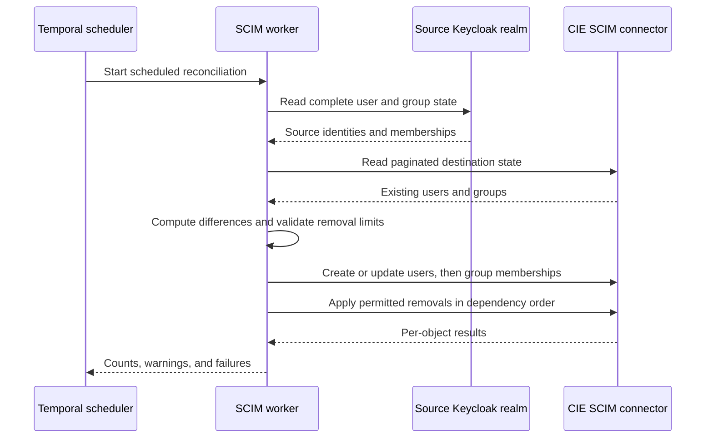

> **Architecture correction — September 14, 2026:** The required harness sends both inference and remote MCP traffic through Prisma AIRS AI Gateway. Earlier direct-MCP flows and their acceptance records describe a divergent implementation. They do not validate the required gateway/CAS path. Read [System architecture](./architecture.md) for the corrected contract.

## Two jobs inside CIE

Cloud Identity Engine's **Directory Sync** makes user and group information available to consuming security services. Its **Cloud Authentication Service**, or CAS, integrates authentication with configured identity providers. Directory membership and a successful browser login are different facts. A service must correlate them and apply its policy. [CIE component overview](https://docs.paloaltonetworks.com/pan-os/10-1/pan-os-new-features/identity-features/cloud-identity-engine).

SCIM is a provisioning protocol. SAML is an authentication federation protocol. OAuth access tokens authorize resource access. These protocols can participate in one architecture while carrying different objects to different receivers.

This is a conceptual CIE integration. It is not the harness's direct MCP token flow. For the native flow, follow [Login from browser to authorized tools](./login.md).

## What the reviewed implementation actually proves

There are two related pieces of source evidence:

1. A Temporal worker reads the **older Truffles realm** through the Keycloak Admin API and writes users and groups into a CIE SCIM connector. Its source config declares a 15-minute schedule; its README records a September 3 live cutover. This is recorded evidence, not a fresh liveness check.
2. A **Redtail CAS SAML client** was adjusted for the Truffles gateway OAuth flow. Its NameID and consumed `username` attribute were mapped to email to resolve a provisioned account. This is an identity-formatting correction, not proof of automatic account linking between realms.

The inspected SCIM configuration does not target the Redtail harness realm. The direct harness/MCP source does not call CIE to issue or validate its native resource token. The curriculum therefore treats Redtail-to-CIE provisioning as an extension that needs its own evidence.

## Provisioning is a reconciliation process

The worker protects against empty source reads and excessive deletion plans. It supports dry-run and preserves transitive parent-group membership. Group display names derive from group paths, avoiding collisions between two different groups called `users`. Its recorded CIE behavior treats missing group `externalId` differently from a changed ID; renaming a group can become a delete/create operation. These are lessons from this adapter, not universal SCIM behavior.

The SCIM connector credential is a machine provisioning credential. It never becomes Alex's MCP bearer token. [SCIM protocol](https://www.rfc-editor.org/info/rfc7644/) and [CIE SCIM setup](https://docs.paloaltonetworks.com/identity/cloud-identity-engine/identify-users-and-devices-with-cie/choose-directory-type/configure-a-cloud-based-directory/configure-scim-connector-for-the-cloud-identity-engine) describe the protocol and product setup separately.

## The identity join must be deliberate

| Identity field | Example | Why it matters |
| --- | --- | --- |
| OIDC issuer and subject | `learning realm`, `user-alex-example` | Stable native-client identity |
| Login handle | `alex` | May differ from email |
| Directory email | `alex@example.com` | May be the consumer's lookup field |
| SAML NameID | `alex@example.com` in this case study | Must satisfy the configured consumer contract |
| SAML username attribute | `alex@example.com` in this case study | A second mapping may also be consumed |
| Group display name | `stacks.learning.users` | Must match policy's directory representation |

An email match alone must not silently merge accounts across issuers. The operator needs a documented correlation policy, unique ownership checks, and a tested rename/deprovisioning procedure. Likewise, a successful SAML test does not prove that directory synchronization or workspace authorization succeeded. [CIE SAML authentication setup](https://docs.paloaltonetworks.com/identity/cloud-identity-engine/authenticate-users-with-the-cloud-identity-engine/set-up-a-saml-2-0-authentication-type).

## Completing a Redtail extension

Use an isolated connector and explicit ownership before adapting the worker; its reconciliation can delete destination objects absent from its source. Define the supported user/group population and identity join. Verify SCIM convergence, SAML identity resolution, workspace policy, allowed and denied users, rename behavior, and measured deprovisioning delay. Document which gateway route actually consumes CIE. Keep the existing direct MCP token contract unless a separately reviewed architecture changes it.

**Checkpoint:** SAML login succeeds but the gateway cannot resolve Alex. Inspect the emitted identity attributes and provisioned directory record before changing the password or weakening the resource policy.

Internal provenance: [Implementation status and public sources](./evidence.md).
