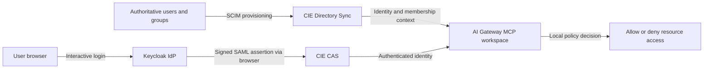
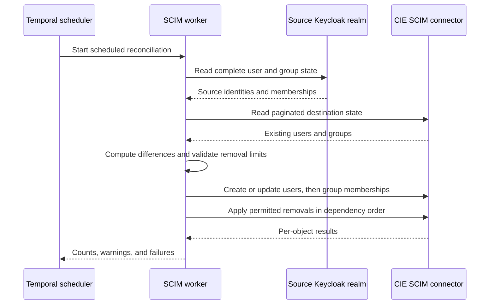

> **Architecture correction — September 14, 2026:** The required harness sends both inference and remote MCP traffic through Prisma AIRS AI Gateway. Earlier direct-MCP flows and their acceptance records describe a divergent implementation. They do not validate the required gateway/CAS path. Read [System architecture](./architecture.md) for the corrected contract.

## Two jobs inside CIE

Cloud Identity Engine's **Directory Sync** makes user and group information available to consuming security services. Its **Cloud Authentication Service**, or CAS, integrates authentication with configured identity providers. Directory membership and a successful browser login are different facts. A service must correlate them and apply its policy. [CIE component overview](https://docs.paloaltonetworks.com/pan-os/10-1/pan-os-new-features/identity-features/cloud-identity-engine).

SCIM is a provisioning protocol. SAML is an authentication federation protocol. OAuth access tokens authorize resource access. These protocols can participate in one architecture while carrying different objects to different receivers.

CAS authentication and CIE directory/workspace resolution are prerequisites of the required gateway-facing MCP route. For the native client flow, follow [Login from browser to authorized tools](./login.md).

## What the reviewed implementation actually proves

The initial source review found an older Truffles SCIM worker and a Redtail CAS SAML email-mapping correction for another workspace. That source alone did not establish the harness population. A later September 14 live inspection found two Redtail reconciliation deployments and verified the intended harness user and MCP group in their CIE directories.

The owner's native gateway login then returned `access_denied` with “User does not have access to this workspace.” Changing to the gateway-supplied connection URL produced the same denial. The owner added the existing MCP group's mapping to the harness workspace, ran Full Sync and confirmed the user in the workspace Members tab. This establishes the operator-reported provisioning repair; successful gateway OAuth, upstream OAuth and tool calls still require separate evidence.

The lesson is concrete: an identity can exist in Keycloak and CIE, belong to the correct source group, and authenticate through CAS while still lacking a gateway workspace assignment. Keep the connected directory and existing mappings; add the intended group-to-workspace mapping instead of granting a broad administrator role or changing the upstream MCP policy. The SDK's general workspace-detail `users` field remained empty after the operator saw the member in SCM, so that field is not a reliable directory-membership check in this deployment.

## Provisioning is a reconciliation process

The worker protects against empty source reads and excessive deletion plans. It supports dry-run and preserves transitive parent-group membership. Group display names derive from group paths, avoiding collisions between two different groups called `users`. Its recorded CIE behavior treats missing group `externalId` differently from a changed ID; renaming a group can become a delete/create operation. These are lessons from this adapter, not universal SCIM behavior.

The SCIM connector credential is a machine provisioning credential. It never becomes Alex's MCP bearer token. [SCIM protocol](https://www.rfc-editor.org/info/rfc7644/) and [CIE SCIM setup](https://docs.paloaltonetworks.com/identity/cloud-identity-engine/identify-users-and-devices-with-cie/choose-directory-type/configure-a-cloud-based-directory/configure-scim-connector-for-the-cloud-identity-engine) describe the protocol and product setup separately.

## The identity join must be deliberate

| Identity field | Example | Why it matters |
| --- | --- | --- |
| OIDC issuer and subject | `learning realm`, `user-alex-example` | Stable native-client identity |
| Login handle | `alex` | May differ from email |
| Directory email | `alex@example.com` | May be the consumer's lookup field |
| SAML NameID | `alex@example.com` in this case study | Must satisfy the configured consumer contract |
| SAML username attribute | `alex@example.com` in this case study | A second mapping may also be consumed |
| Group display name | `stacks.learning.users` | Must match policy's directory representation |

An email match alone must not silently merge accounts across issuers. The operator needs a documented correlation policy, unique ownership checks, and a tested rename/deprovisioning procedure. Likewise, a successful SAML test does not prove that directory synchronization or workspace authorization succeeded. [CIE SAML authentication setup](https://docs.paloaltonetworks.com/identity/cloud-identity-engine/authenticate-users-with-the-cloud-identity-engine/set-up-a-saml-2-0-authentication-type).

## Verifying the required harness mapping

Inspect the existing configured directory before deciding whether another connector is needed. If adapting a reconciliation worker, use isolated ownership: it can delete destination objects absent from its source. Verify the supported population, identity join, SAML resolution, harness workspace mapping, allowed and denied users, rename behavior and measured deprovisioning delay. A missing mapping must be repaired at this boundary; it does not authorize a direct upstream connection.

**Checkpoint:** SAML login succeeds but the gateway cannot resolve Alex. Inspect the emitted identity attributes and provisioned directory record before changing the password or weakening the resource policy.

Internal provenance: [Implementation status and public sources](./evidence.md).
