## The gateway is the destination for both traffic paths

If you have put a reverse proxy in front of an API, you already have most of the model for Prisma AIRS AI Gateway. It sits between the harness and the model endpoint, and every inference request has to pass through it before a model sees the prompt. What the proxy frame does not capture is how much the gateway decides in that position. In this implementation it validates a human inference JWT, binds the request to an allowed workspace and saved configuration, and invokes mandatory input and output AIRS checks. The model provider credential stays on the server side, which means the harness never holds the key that actually reaches the model.

The product supports SaaS and hybrid deployment models. This case study uses a hybrid data plane with centrally managed configuration. The gateway has two listeners, and both request paths in this architecture are required to use it. The inference listener forwards model requests. The MCP listener authorizes the user and proxies the configured upstream service with gateway-managed OAuth, so the harness never negotiates directly with mcp server 1. Both upstream deployments now accept only gateway-owned OAuth clients, which is what turns the routing requirement into an enforced one: a client that bypassed the gateway would have no credential the upstream accepts. The current package and verification scope is tracked in the implementation-status lesson. [Gateway product overview](https://docs.paloaltonetworks.com/ai-runtime-security/administration/configure-ai-gateway).

## Follow a request through the policies

```mermaid
flowchart LR
    accTitle: Logical inference enforcement sequence
    accDescr: The gateway validates identity and routing, evaluates input, invokes the model when allowed, evaluates output, and returns an allowed response or a policy failure.
    request["Inference request"] --> identity["Verify JWT and invoke permission"]
    identity --> routing["Bind workspace and saved config"]
    routing --> input["Evaluate input content"]
    input --> inputDecision{"Allowed?"}
    inputDecision -->|"Yes"| model["Call approved model"]
    inputDecision -->|"No or blocking timeout"| deny["Return policy failure"]
    model --> output["Evaluate output content"]
    output --> outputDecision{"Allowed?"}
    outputDecision -->|"Yes"| answer["Return permitted response"]
    outputDecision -->|"No or blocking timeout"| deny
```

Take Alex's question as it leaves the harness. Before a model sees it, the gateway asks a sequence of questions about the request, and a "no" at any of them ends the request there.

Read this as a logical order, not a timing diagram. It says that identity is checked before routing, input before the model, and output before the response, and that a blocking scanner timeout counts as a denial rather than a pass. It does not say how a streamed response is buffered token by token. The recorded acceptance includes streaming requests and scan verdicts, but a claim about exactly when each chunk is released would need dedicated wire-level evidence, and this diagram is not that evidence.

The first step deserves a closer look, because it is where a bearer token becomes a decision. The reviewed JWT guardrail checks the issuer and signature, the inference audience, the native client's authorized-party claim, the `invoke` grant, and the issued completion permission. Routing claims in the token then select the dedicated workspace and default configuration, and configuration override is disabled. That last setting is the one that makes the others meaningful: correct defaults alone would not enforce access if a caller could override them in the request.

## Four objects that are easy to confuse

By this point four gateway objects have appeared, and they are easy to run together because all of them shape what happens to a request. They answer different questions.

| Object | Purpose | Running example |
| --- | --- | --- |
| Workspace | Organizes permitted integrations and policy context | Alex's learning workspace |
| Saved gateway configuration | Chooses routing and attached guardrails | Approved model route |
| Gateway guardrail | Invokes or evaluates a check on a request/response | JWT check or AIRS plugin |
| AIRS security profile | Defines scanner protections and actions | Prompt-injection and toxicity policy |

The profile recorded for this harness has prompt-injection, malicious-code, agent, and toxicity protections, with blocking scanner timeouts and stored-data masking. No DLP profile was selected in that acceptance record. So when someone says “AIRS is enabled,” the accurate follow-up is which protections the active profile actually defines; enabled does not mean every available protection is on.

There is a second reason to name the profile precisely. The gateway references the active profile by name in this deployment, so an updated profile revision can change behavior without any change to the harness binary. Evidence about scanning therefore needs both the configuration context and the profile revision that was observed during acceptance. A result recorded against one revision does not describe the next.

## The tool loop crosses inference again

The gateway's position matters twice in one question. After mcp server 1 returns a utility result, the harness can include that result in the next model request, and that request travels through the inference gateway like the first one did. MCP protocol traffic must also traverse the gateway MCP listener. Be careful about what that routing requirement proves, though. It establishes that the gateway is in the path; it does not by itself establish that any particular scanner runs on each MCP message. Verify the configured MCP checks and their execution separately. Gateway authorization, upstream utility grants, argument validation and content scanning are distinct controls, and passing one is not evidence of passing another.

There is also a content reason to keep the tool loop in view. Text and JSON utility output can carry untrusted content that arrived as input, so a tool result should be treated as data, not as a new source of instructions. Content checks help evaluate inputs and outputs. They do not grant workspace access, and they do not replace the harness's local tool approval rules.

## Evidence to collect

If you later need to show what the gateway did with a request, collect the observations that answer each stage's question. For an allowed question, retain a correlation ID, the selected workspace and configuration, the input and output verdicts, the response status, and the model route. For a denial, retain the failing stage and the policy reason, without logging the token. A 446 was observed for specific guardrail failures in this deployment; it is not an OAuth-standard status code, so do not expect it from other gateways or interpret it as an authentication result.

**Checkpoint:** calculate returns 84. Does that result prove that inference was scanned? No. The utility result shows that mcp server 1 executed one operation. A scanner verdict is a separate observation, correlated by request, and nothing about the number 84 carries it. Gateway profiles are administered outside this utility tool surface, so the tools cannot report on them either.

Continue with [MCP utility tools and authorization](./mcp.md). Implementation and acceptance sources: [Implementation status and public sources](./evidence.md).
