> **Architecture correction — September 14, 2026:** The required harness sends both inference and remote MCP traffic through Prisma AIRS AI Gateway. Earlier direct-MCP flows and their acceptance records describe a divergent implementation. They do not validate the required gateway/CAS path. Read [System architecture](./architecture.md) for the corrected contract.

## The gateway controls the inference boundary

Prisma AIRS AI Gateway sits between the harness and the model endpoint. In this implementation, the gateway validates a human inference JWT, binds the request to an allowed workspace and saved configuration, and invokes mandatory input and output AIRS checks. The model provider credential remains on the server side.

The product supports SaaS and hybrid deployment models. This case study uses a hybrid data plane with centrally managed configuration. Product support for MCP proxying does not mean every MCP request in this project uses that proxy: the harness connects directly to `prisma-airs-mcp`. [Gateway product overview](https://docs.paloaltonetworks.com/ai-runtime-security/administration/configure-ai-gateway).

## Follow a request through the policies

```mermaid
flowchart LR
    accTitle: Logical inference enforcement sequence
    accDescr: The gateway validates identity and routing, evaluates input, invokes the model when allowed, evaluates output, and returns an allowed response or a policy failure.
    request["Inference request"] --> identity["Verify JWT and invoke permission"]
    identity --> routing["Bind workspace and saved config"]
    routing --> input["Evaluate input content"]
    input --> inputDecision{"Allowed?"}
    inputDecision -->|"Yes"| model["Call approved model"]
    inputDecision -->|"No or blocking timeout"| deny["Return policy failure"]
    model --> output["Evaluate output content"]
    output --> outputDecision{"Allowed?"}
    outputDecision -->|"Yes"| answer["Return permitted response"]
    outputDecision -->|"No or blocking timeout"| deny
```

This is a logical enforcement sequence. It does not specify token-by-token streaming buffering. The recorded acceptance includes streaming requests and scan verdicts, but a claim about exactly when each chunk is released requires dedicated wire-level evidence.

The reviewed JWT guardrail checks issuer/signature, inference audience, the native client's authorized-party claim, the `invoke` grant, and the issued completion permission. Routing claims select the dedicated workspace and default configuration; configuration override is disabled. Correct defaults alone would not enforce access if callers could override them.

## Four objects that are easy to confuse

| Object | Purpose | Running example |
| --- | --- | --- |
| Workspace | Organizes permitted integrations and policy context | Alex's learning workspace |
| Saved gateway configuration | Chooses routing and attached guardrails | Approved model route |
| Gateway guardrail | Invokes or evaluates a check on a request/response | JWT check or AIRS plugin |
| AIRS security profile | Defines scanner protections and actions | Prompt-injection and toxicity policy |

The profile recorded for this harness has prompt-injection, malicious-code, agent, and toxicity protections, with blocking scanner timeouts and stored-data masking. No DLP profile was selected in that acceptance record. Do not turn “AIRS enabled” into a claim that every available protection is enabled.

The gateway references the active profile by name in this deployment. An updated profile revision can change behavior without a harness binary update. Evidence therefore needs both configuration context and the profile revision observed during acceptance.

## The tool loop crosses inference again

After the MCP server returns a safe configuration summary, the harness can include that result in the next model request. That next request travels through the inference gateway. The direct MCP transport itself is not routed through the gateway scanner in this architecture. Server-side authorization, output projection, and content scanning are distinct controls.

Read-only data can still contain misleading names or descriptions. Treat tool output as data, not as a new instruction source. Content checks help evaluate inputs and outputs; they do not grant workspace access or replace local tool approval rules.

## Evidence to collect

For an allowed question, retain a correlation ID, selected workspace/config, input and output verdicts, response status, and model route. For a denial, retain the failing stage and policy reason without logging the token. A 446 was observed for specific guardrail failures in this deployment; it is not an OAuth-standard status code.

**Checkpoint:** the assistant can inspect a profile through MCP. Has it proved that a particular answer was scanned using that profile? **No.** Configuration inventory and runtime execution evidence answer different questions.

Continue with [Read-only MCP authorization](./mcp.md). Implementation and acceptance sources: [Implementation status and public sources](./evidence.md).
