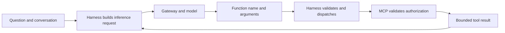

## The harness owns the execution loop

Prisma AIRS Harness is a standalone Rust terminal application. Its local responsibilities include the conversation, repository access, tool dispatch, approval policy, and credential-store integration. The similarly named hosted application is a separate project and is not required for this architecture.

When Alex asks about gateway protections, the harness makes tool schemas available to the model. A schema tells the model a tool's name, its purpose, and its required arguments. It does not give the model a service credential or permission to access every object matching those arguments.

The cycle may repeat. A list call can discover an authorized workspace ID; a later detail call uses that ID. The final answer should be grounded in the tool results and explain when information is unavailable. The model should not guess a hidden workspace's contents.

## Two credential channels

| Connection | Destination | Credential presentation in this implementation |
| --- | --- | --- |
| Inference | Gateway Responses API | Human inference JWT in `x-portkey-api-key` |
| Direct MCP | MCP Streamable HTTP endpoint | MCP resource JWT in `Authorization: Bearer` |

The inference header name is an implementation compatibility contract. It does not mean the value is a permanent API key. The MCP bearer token is a different token, for a different audience and native client. Use the same human account for both logins. The stock MCP client stores its OAuth credentials independently; the MCP server enforces its own subject policy.

Token bundles live in the operating system credential store. Configuration records contain nonsecret settings and binding metadata. The implementation uses Linux Secret Service and macOS Keychain; Windows is outside this release’s distribution and end-to-end acceptance scope. Native MCP storage is explicitly configured as `keyring`; the upstream `auto` mode can fall back to a credentials file. A successful Linux login does not establish macOS desktop behavior.

## A real compatibility lesson

The reviewed gateway path dropped Responses tool declarations wrapped in a `namespace`. That left the model without callable tools even though the MCP server was healthy. The harness's gateway adapter now flattens those declarations at the HTTP boundary and restores their namespace on returned tool-call events before local dispatch.

```mermaid
flowchart LR
    accTitle: Gateway tool compatibility adapter
    accDescr: The adapter flattens canonical namespaces for the inference wire format and restores them on returned function calls before local dispatch.
    canonical["Canonical namespaced tool definitions"] --> flatten["Gateway adapter flattens names"]
    flatten --> wire["Wire function definitions"]
    wire --> reply["Model returns function call"]
    reply --> restore["Adapter restores namespace"]
    restore --> dispatch["Existing harness tool dispatch"]
```

This repair preserves call IDs and arguments. Unknown names are not guessed, and ambiguous aliases are rejected. The canonical conversation remains in the harness's own representation. This is a deployment-specific compatibility lesson, not a claim that all gateways or all MCP clients require this transform.

## What the harness cannot authorize

A model's tool selection cannot add a Keycloak role. A local tool approval cannot add a server resource binding. Conversely, read-only MCP tools do not make the whole harness read-only: local shell and file tools have their own capabilities and controls. Explain the permission boundary for the tool actually being used.

**Checkpoint:** the model returns `get_gateway_config` with an unauthorized workspace ID. The harness can dispatch a syntactically valid call, but the MCP server must refuse to expose that workspace. The model's decision is not an authorization grant.

Continue with [Keycloak and token contracts](./keycloak.md). Implementation basis: [Implementation status and public sources](./evidence.md).
