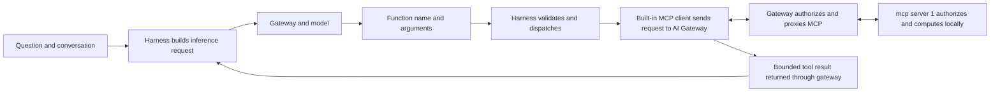

```mermaid
flowchart LR
    accTitle: Gateway tool compatibility adapter
    accDescr: The adapter flattens canonical namespaces for the inference wire format and restores them on returned function calls before local dispatch.
    canonical["Canonical namespaced tool definitions"] --> flatten["Gateway adapter flattens names"]
    flatten --> wire["Wire function definitions"]
    wire --> reply["Model returns function call"]
    reply --> restore["Adapter restores namespace"]
    restore --> dispatch["Existing harness tool dispatch"]
```

## The harness owns the execution loop

When Alex types the question, the first component that sees it is the harness, and the harness is the component that owns the conversation from then on. Prisma AIRS Harness is a standalone Rust terminal application. Its local responsibilities include the conversation, repository access, tool dispatch, approval policy, and credential-store integration. The similarly named hosted application is a separate project and is not required for this architecture.

Remote tools are handled by the harness's inherited Codex MCP client, which runs inside the normal `airs-harness` process and takes care of remote tool discovery, browser OAuth and Streamable HTTP. Users manage this connection through `mcp add`, `mcp login`, `mcp list` and `mcp logout`, and inspect it with `/mcp` in the interactive terminal. No secondary MCP command is required. Upstream [Codex MCP documentation](https://developers.openai.com/codex/mcp/) describes the underlying client capabilities; the commands and release limits in this course describe the reviewed harness fork.

When Alex asks for a calculation and server time, the harness makes tool schemas available to the model. A schema tells the model a tool's name, its purpose, and its required arguments. That is all it does. It does not grant the model access to anything: gateway policy and the server's utility authorization still apply to every call the model proposes, and the model has no way to satisfy either of them on its own.

The cycle may repeat. The model might request a calculation first and then the server clock, with a fresh inference request between them. The answer at the end should use completed results and identify any operation that failed. A tool schema in the request, or a model's statement that it will call a tool, is not evidence that the tool ran. Only the completed tool event and its result are.

## Two credential channels

Because the harness talks to the gateway on two paths, it holds two credentials, presented differently.

| Connection | Destination | Credential presentation in this implementation |
| --- | --- | --- |
| Inference | Gateway Responses API | Human inference JWT in `x-portkey-api-key` |
| MCP | AI Gateway MCP integration endpoint | Gateway-facing OAuth access token |

The inference header name is an implementation compatibility contract, and a good example of why you should not infer a credential's nature from where it travels. The value in that header is a human inference JWT, not a permanent API key, even though the header is named as if it were one. The gateway-facing MCP token has its own OAuth contract and is stored independently. Use the intended human account for both logins. What the harness never holds is the upstream credential: the gateway separately obtains upstream MCP access and refresh tokens, and those stay at the gateway. mcp server 1 enforces invoke, utilities.use and its subject policy against that upstream token.

Token bundles live in the operating system credential store, while configuration records contain nonsecret settings and binding metadata. The implementation uses Linux Secret Service and macOS Keychain; Windows is outside this release's distribution and end-to-end acceptance scope. Native MCP storage is explicitly configured as `keyring` because the upstream `auto` mode can fall back to a credentials file. The two platforms have to be verified separately: a successful Linux login does not establish macOS desktop behavior.

One detail of the keyring layout has practical consequences. Native MCP keyring records are shared by operating-system user and keyed by server name and endpoint. A separate harness home alone therefore does not isolate a matching MCP credential; two homes pointing at the same server name and endpoint share one record, and the client coordinates refreshes across the homes that share it. The case study's live acceptance runs use a unique MCP server name for this reason, so their sign-in and logout checks stay separate from the user's everyday credential while the gateway destination stays the same. That isolates the local record only. A shared browser can still bind inference logins to the same Keycloak client session, so parallel acceptance runs coordinate issuer logout until all peer workflows have finished.

The client also handles gateway dynamic client registration. Adding a native OAuth server without an explicit client ID must preserve the existing inference environment and history. Because a change on the MCP side must not disturb the inference side, that behavior needs its own regression and installed-package checks.

## A real compatibility lesson

This one came out of the observed deployment rather than the protocol documents. The reviewed gateway path dropped Responses tool declarations wrapped in a `namespace`. The effect was that the model had no callable tools even though the MCP server was healthy, which is the kind of failure that sends people to the wrong component. The harness's gateway adapter now flattens those declarations at the HTTP boundary and restores their namespace on returned tool-call events before local dispatch.

The adapter is deliberately narrow. It preserves call IDs and arguments, does not guess at unknown names, and rejects ambiguous aliases rather than picking one. The canonical conversation remains in the harness's own representation, with the flattening confined to the wire format. Treat this as a deployment-specific compatibility lesson, not a claim that all gateways or all MCP clients require this transform.

## What the harness cannot authorize

Each actor in the loop has limits worth stating. A model's tool selection cannot add a Keycloak role. A local tool approval cannot add a server resource binding. The reverse holds too: read-only MCP tools do not make the whole harness read-only, because local shell and file tools have their own capabilities and controls. Explain the permission boundary for the tool actually being used rather than for the harness as a whole.

**Checkpoint:** the model selects `hash_text`, but Alex lacks the utilities.use grant. What happens? The server rejects access, even though the tool only computes a digest. The deciding fact is that model selection is not an authorization grant; the simplicity of the operation never enters the decision.

Continue with [Keycloak and token contracts](./keycloak.md). Implementation basis: [Implementation status and public sources](./evidence.md).
