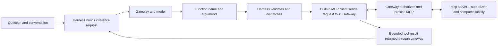

```mermaid
flowchart LR
    accTitle: Gateway tool compatibility adapter
    accDescr: The adapter flattens canonical namespaces for the inference wire format and restores them on returned function calls before local dispatch.
    canonical["Canonical namespaced tool definitions"] --> flatten["Gateway adapter flattens names"]
    flatten --> wire["Wire function definitions"]
    wire --> reply["Model returns function call"]
    reply --> restore["Adapter restores namespace"]
    restore --> dispatch["Existing harness tool dispatch"]
```

## Commands and bundled product tools

The npm package is named `airs-harness`; its public command is `airs`. `airs cli ...` runs the bundled Prisma AIRS CLI 7.1.5 without a second installation. A separately installed product CLI uses `airs-cli ...`. Embedded skills use the harness's private bundled executable.

Harness environments select gateway connections, human login bindings and conversation history. Product CLI tenants select Prisma AIRS credentials from tenant JSON. These selections are independent: switching environments does not switch the CLI tenant, and company SSO does not create a management API credential. See [Login from browser to authorized tools](./login.md) for installation, migration and a complete first session.

## Welcome and sign-in

The onboarding releases add an animated AIRS welcome screen to `airs`. A fresh user creates an environment, provides public company settings and completes browser or device SSO. A returning signed-out user sees the selected environment and sign-in choices; an existing usable sign-in enters the agent immediately. The screen distinguishes saving the credential from verifying gateway inference access. MCP login remains a separate step with the same intended company identity.

Version **0.1.2** brings the tested onboarding and MCP workflows to the stable release. Use `airs env` to create, inspect, select and remove environments, `airs cli` for the bundled product CLI, `/mcp` for connections and `/doctor` for diagnostics. New environments use native MCP storage; upgrades retain existing storage modes and credentials. The corrected Ubuntu SSH helper, supported-Node checks and recovery commands scoped to the selected environment are included. See [Login from browser to authorized tools](./login.md) for installation and the complete workflow.

Desktop MCP sign-in opens the browser automatically; SSH sessions provide explicit callback instructions. Long authorization links scroll, and progress distinguishes authorization, credential storage and tool discovery. The owner confirmed inference, ServiceNow and restart/reuse on alpha.5, together with the Jev workflow. Stable 0.1.2 preserves that runtime behavior.

Use `/typesafe` to configure an optional environment-scoped Jev key inside AIRS. The bundled `prisma-airs-asr-judge` skill delegates to CLI 7.1.5's TypeScript implementation. Live judging asks for per-command approval to access the native credential store and TypeSafe network endpoint; dry runs and explicit replay retain the shell sandbox. No Python runtime or separate CLI installation is required. This optional third credential channel is independent of inference and MCP authorization.

## Selective upstream reliability preview

Test release **0.1.3-alpha.2.mcp.1** is available from the AIRS npm registry. Stable remains **0.1.2**. The preview preserves AIRS's gateway authentication while adopting selected Codex reliability improvements.

Install the preview explicitly, replacing `npm.example.com` with your organization’s approved registry:

```bash
npm install -g airs-harness@0.1.3-alpha.2.mcp.1 --registry=https://npm.example.com
airs --version
airs cli --version
```

The bundled CLI remains 7.1.5. To return to stable, install `airs-harness@0.1.2` from the same registry. Upgrade and rollback were checked with isolated environments, histories and native credentials; no credential or history migration is required.

Cancel and Escape belong to the operation that displayed them, so a delayed action cannot cancel a later login or diagnostic check. If a conversation cannot be attached, `/signin`, `/doctor`, `/mcp` and `/typesafe` remain available; ordinary text stays in the draft. `/new` starts a writable conversation. Recovery does not automatically replay an inference request or tool call.

Access verification shows its completion time and rejects a result if gateway configuration, model catalog or authentication generation changes during the check. The same timestamp appears through the shell and `/doctor`. A timestamp records the check, including a failed check; it is not a lasting authorization grant. This preview also stops replaying inference after HTTP 401, 403 or 446, recognizes explicit gateway policy denials returned inside HTTP 200 responses, and bounds the catalog-read portion of doctor. See [Troubleshooting by trust boundary](./troubleshooting.md) for recovery actions.

No new MCP device authorization or authentication service is included. Inference OIDC/workspace keys, gateway-facing MCP OAuth and optional Jev credentials retain their separate roles. Broader remote-executor, daemon and fullscreen changes are deferred.

## Mac-first terminal preview

**0.1.3-alpha.3.mcp.1 is published under `mac-preview`.** This preview adds
selected terminal improvements on top of alpha.2. Its first distribution is for
Apple Silicon macOS only. Linux builds wait for owner Mac acceptance, and stable
remains 0.1.2. The existing `mcp` tag continues to select alpha.2 for all three
supported platforms.

On an Apple Silicon Mac, replace `npm.example.com` with your approved registry:

```bash
npm install -g airs-harness@0.1.3-alpha.3.mcp.1 --registry=https://npm.example.com
airs --version
airs cli --version
```

Expect harness `0.1.3-alpha.3.mcp.1` and CLI `7.1.5`. The native executable is
Developer ID signed and Apple notarized. Exact candidate and fresh registry
installations passed controlled terminal, native-store, MCP and Jev approval
checks. Upgrade and rollback were checked from both stable 0.1.2 and alpha.2;
install either previous exact version from the same registry to return to it.
No manual credential or conversation migration is needed.

- Open and close the transcript with **Ctrl+T** while composing a draft. Returning
  to the conversation preserves the draft, including after resizing the terminal.
- `/copy` uses the latest completed assistant message, including commentary that
  arrived after an earlier final answer. It does not copy an unfinished stream.
- If an active turn ends while you are typing answers to its questions, AIRS
  recovers those answers into the composer. Review or edit them before sending;
  recovery does not automatically submit them. An active history search retains
  its query and preview; cancelling the search restores the recovered draft.
- Narrow prompt wrapping retains complete hyperlink destinations. Unix tmux
  sessions receive background size checks without a geometry query on the UI thread.

Inference sign-in, `/mcp`, `/doctor`, `/typesafe`, gateway route selection and Jev's
per-command approval continue to use the existing AIRS flows. Upstream fullscreen
selection and transcript search are a separate renderer migration and are not
included in this preview. The inline terminal remains the default.

After installing the published Mac preview, test a conversation through your
normal gateway, a read-only ServiceNow request through `/mcp`, and reuse after
restarting AIRS. Also type an unsent draft, open the transcript, resize the window,
and close it; the draft should remain. If you use Jev, confirm the skill still
requests the normal approval and reads the selected environment's saved key.
Automated fixture checks do not replace these real-account checks.

## The harness owns the execution loop

When Alex types the question, the first component that sees it is the harness, and the harness is the component that owns the conversation from then on. Prisma AIRS Harness is a standalone Rust terminal application. Its local responsibilities include the conversation, repository access, tool dispatch, approval policy, and credential-store integration. The similarly named hosted application is a separate project and is not required for this architecture.

Remote tools are handled by the harness's inherited Codex MCP client, which runs inside the normal `airs` process and takes care of remote tool discovery, browser OAuth and Streamable HTTP. In 0.1.2, `/mcp` opens **MCP connections** with **Add gateway MCP server**, **Sign in**, **Sign out**, **Reconnect and verify** and **Remove connection**. After a connection change, **Start new conversation** keeps the process open and preserves history and the draft without replaying requests. `/doctor` inspects the current environment and offers an explicitly confirmed inference access check. Shell `airs mcp` commands remain optional fallbacks; no separate MCP executable is required. Upstream [Codex MCP documentation](https://developers.openai.com/codex/mcp/) describes the underlying client capabilities; the commands and release limits in this course describe the reviewed harness fork.

When Alex asks for a calculation and server time, the harness makes tool schemas available to the model. A schema tells the model a tool's name, its purpose, and its required arguments. That is all it does. It does not grant the model access to anything: gateway policy and the server's utility authorization still apply to every call the model proposes, and the model has no way to satisfy either of them on its own.



The cycle may repeat. The model might request a calculation first and then the server clock, with a fresh inference request between them. The answer at the end should use completed results and identify any operation that failed. A tool schema in the request, or a model's statement that it will call a tool, is not evidence that the tool ran. Only the completed tool event and its result are.

## Two credential channels

Because the harness talks to the gateway on two paths, it holds two credentials, presented differently.

| Connection | Destination | Credential presentation in this implementation |
| --- | --- | --- |
| Inference | Gateway Responses API | Company SSO JWT or workspace API key in `x-portkey-api-key` |
| MCP | AI Gateway MCP integration endpoint | Gateway-facing OAuth access token |

The inference header name is an implementation compatibility contract, and a good example of why you should not infer a credential's nature from where it travels. The value can be a company inference JWT or a workspace API key, depending on the environment's selected authentication method. A workspace key does not create a browser SSO identity or authorize MCP. The gateway-facing MCP token has its own OAuth contract and is stored independently. For company SSO inference, use the intended human account for both logins. With workspace-key inference, MCP still requires its own organizational sign-in and workspace grant. What the harness never holds is the upstream credential: the gateway separately obtains upstream MCP access and refresh tokens, and those stay at the gateway. mcp server 1 enforces invoke, utilities.use and its subject policy against that upstream token.

Inference credentials use the operating system credential store, while configuration records contain nonsecret settings and binding metadata. New environments created by mcp.4 and later also require native MCP storage through the generated top-level `mcp_oauth_credentials_store = "keyring"` setting. An unavailable native store causes sign-in to fail without a plaintext fallback. Existing environments retain their omitted, `auto`, `file` or `keyring` setting and saved credentials; existing `auto` mode can still fall back to a file. A configuration edit alone does not migrate tokens. Follow the [login lesson's optional migration procedure](./login.md) to sign out under the original mode before changing it. The implementation uses Linux Secret Service and macOS Keychain; Windows is outside this release's distribution and end-to-end acceptance scope. Verify each platform separately: a successful Linux login does not establish macOS desktop behavior.

One detail of the keyring layout has practical consequences. Native MCP keyring records are shared by operating-system user and keyed by server name and endpoint. A separate harness home alone therefore does not isolate a matching MCP credential; two homes pointing at the same server name and endpoint share one record, and the client coordinates refreshes across the homes that share it. The case study's live acceptance runs use a unique MCP server name for this reason, so their sign-in and logout checks stay separate from the user's everyday credential while the gateway destination stays the same. That isolates the local record only. A shared browser can still bind inference logins to the same Keycloak client session, so parallel acceptance runs coordinate issuer logout until all peer workflows have finished.

The client also handles gateway dynamic client registration. Adding a native OAuth server without an explicit client ID must preserve the existing inference environment and history. Because a change on the MCP side must not disturb the inference side, that behavior needs its own regression and installed-package checks.

## A real compatibility lesson

This one came out of the observed deployment rather than the protocol documents. The reviewed gateway path dropped Responses tool declarations wrapped in a `namespace`. The effect was that the model had no callable tools even though the MCP server was healthy, which is the kind of failure that sends people to the wrong component. The harness's gateway adapter now flattens those declarations at the HTTP boundary and restores their namespace on returned tool-call events before local dispatch.



The adapter is deliberately narrow. It preserves call IDs and arguments, does not guess at unknown names, and rejects ambiguous aliases rather than picking one. The canonical conversation remains in the harness's own representation, with the flattening confined to the wire format. Treat this as a deployment-specific compatibility lesson, not a claim that all gateways or all MCP clients require this transform.

## What the harness cannot authorize

Each actor in the loop has limits worth stating. A model's tool selection cannot add a Keycloak role. A local tool approval cannot add a server resource binding. The reverse holds too: read-only MCP tools do not make the whole harness read-only, because local shell and file tools have their own capabilities and controls. Explain the permission boundary for the tool actually being used rather than for the harness as a whole.

**Checkpoint:** the model selects `hash_text`, but Alex lacks the utilities.use grant. What happens? The server rejects access, even though the tool only computes a digest. The deciding fact is that model selection is not an authorization grant; the simplicity of the operation never enters the decision.

Continue with [Keycloak and token contracts](./keycloak.md). Implementation basis: [Implementation status and public sources](./evidence.md).
