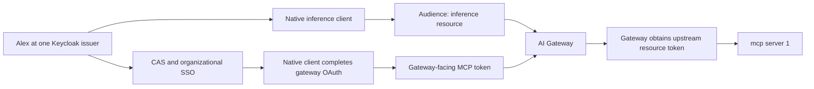

## Identity starts with the issuer and subject

If you have worked with API keys, you are used to a credential that means one thing: this caller may use this API. The tokens in this system carry more than that, and reading them well is most of this lesson. Keycloak authenticates Alex for inference, and it federates organizational login through CAS for gateway-facing MCP access. The gateway exposes the MCP OAuth endpoints that the native client talks to. A separate Keycloak OAuth registration supplies the gateway with upstream MCP tokens. Keycloak therefore appears in the story more than once, and each receiver enforces its own token and access contract rather than trusting a neighbor's.

The durable user identity is the pair **issuer and subject**. An email is a useful human-facing attribute, but it is not an identity: two realms can contain the same email while issuing unrelated subjects. That distinction matters whenever a directory, a federation service and a resource server have to agree that they are talking about the same person.

## Read a token as a contract

The following JSON illustrates an upstream token held by the gateway. It is unsigned fictional content, not a valid JWT or a harness-to-gateway token:

```json
{
  "iss": "https://login.example.com/realms/learning",
  "sub": "user-alex-example",
  "aud": "https://mcp.example.com/mcp",
  "azp": "learning-gateway-mcp",
  "scope": "utilities.use",
  "resource_access": {
    "learning-mcp-resource": {"roles": ["invoke", "utilities.use"]}
  },
  "iat": 1800000000,
  "exp": 1800000300
}
```

Each claim answers a question, and the receiver owes a check for each answer.

| Field | Question answered | Receiver's responsibility |
| --- | --- | --- |
| `iss` | Who issued this? | Require the configured issuer |
| `sub` | Which identity at that issuer? | Resolve explicit user access |
| `aud` | Which resource is this for? | Require this server's audience |
| `azp` | Which client obtained it? | Apply the client allowlist |
| `scope` | Which permissions were issued? | Intersect with roles and policy |
| Resource roles | Which grants apply to this resource? | Ignore unrelated client roles |
| `iat`, `exp` | When was it issued and when does it expire? | Enforce time and lifetime limits |

Decoding the JSON is not validation. Anyone can produce a document that looks like this one. The receiver must verify the signature with trusted keys and reject an unexpected algorithm, issuer, audience, or lifetime, because each of those is a way for a token that looks right to be wrong for this receiver. The reviewed MCP service pins RS256, checks the required claims, and uses public keys from its fixed issuer's JWKS.

## Three token contracts, one SSO experience

From Alex's chair the whole thing can feel like one sign-in. Three separate tokens are in play.



| Credential | Issued by | Held by | Used at |
| --- | --- | --- | --- |
| Inference access JWT | Keycloak | Harness identity store | Gateway inference listener |
| Opaque MCP access token | Gateway OAuth endpoint after CAS login | Native MCP credential store | Gateway MCP listener |
| Upstream MCP access JWT | Keycloak, for the confidential gateway client | Gateway | Upstream MCP resource server |

The lifetimes differ too. The observed gateway 2.22.0 MCP access lifetime is 3,600 seconds, while the upstream JWT lifetime is 300 seconds. The gateway-facing token is opaque; a Keycloak browser login somewhere in its history does not make it a JWT. Treat these numbers as deployment settings, not OAuth defaults, because another deployment can set them differently.

A browser SSO session may spare Alex a second password prompt, but it does not make the issued access tokens interchangeable. The clients differ as well. The native harness is a public OAuth client and uses PKCE, since a program on a workstation cannot keep a secret. The gateway upstream integration has a separate confidential client whose secret stays server-side. The reviewed upstream registration uses authorization code with PKCE S256 and disables the service-account, password and implicit grants, which narrows how that client can obtain a token to the one path the architecture intends.

The token types have different receivers, and sending one to the wrong place is a common error. An **ID token** lets the client verify the authenticated identity. An **access token** authorizes access at a resource server. A **refresh token** is presented to the authorization server to obtain a new token generation. Send each artifact only to its intended receiver. Note what is absent: mcp server 1 has no downstream API credential for tool execution, so there is no fourth token to account for on that side.

## How groups become permissions

Group membership in Keycloak does not arrive at the server as group membership. Keycloak groups can grant resource-client roles, and client scope mappings control which of those grants appear in a token. Even then, the token is only part of the decision: mcp server 1 still requires an explicit subject binding for utilities.use, the corresponding token scope and resource role, and invoke. Registering a client or completing login is not enough to authorize a utility call, because neither step produces the server-side binding.

**Checkpoint:** a signed token has the correct issuer but the inference audience. Should MCP accept it because Alex is a legitimate user? **No.** The deciding fact is the audience: the token was issued for another resource, and a legitimate user holding the wrong token is still holding the wrong token.

Protocol background: [Keycloak OIDC endpoints](https://www.keycloak.org/securing-apps/oidc-layers). Native-client rationale: [RFC 8252](https://www.rfc-editor.org/info/rfc8252/). Implementation-specific checks are documented in [Implementation status and public sources](./evidence.md).
