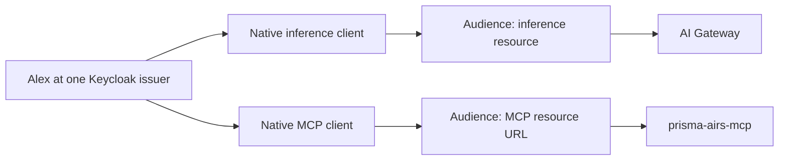

## Identity starts with the issuer and subject

Keycloak plays two protocol roles in the native harness flow: it is the OpenID Connect identity provider and the OAuth authorization server. It authenticates Alex and issues tokens. The MCP server and gateway validate the tokens and enforce their own access rules.

The durable user identity is the pair **issuer and subject**. An email is a useful human-facing attribute, but two realms can contain the same email while issuing unrelated subjects. That distinction matters when integrating Redtail with an older CIE directory population.

## Read a token as a contract

The following JSON is an unsigned fictional claim illustration, not a valid JWT:

```json
{
  "iss": "https://login.example.com/realms/learning",
  "sub": "user-alex-example",
  "aud": "https://mcp.example.com/mcp",
  "azp": "learning-harness-mcp",
  "scope": "airs.gateway.read",
  "resource_access": {
    "learning-mcp-resource": {"roles": ["invoke", "gateway.read"]}
  },
  "iat": 1800000000,
  "exp": 1800000300
}
```

| Field | Question answered | Receiver's responsibility |
| --- | --- | --- |
| `iss` | Who issued this? | Require the configured issuer |
| `sub` | Which identity at that issuer? | Resolve explicit user access |
| `aud` | Which resource is this for? | Require this server's audience |
| `azp` | Which client obtained it? | Apply the client allowlist |
| `scope` | Which permissions were issued? | Intersect with roles and policy |
| Resource roles | Which grants apply to this resource? | Ignore unrelated client roles |
| `iat`, `exp` | When was it issued and when does it expire? | Enforce time and lifetime limits |

Decoding JSON is not validation. The receiver must verify the signature with trusted keys and reject an unexpected algorithm, issuer, audience, or lifetime. The reviewed MCP service pins RS256, checks required claims, and uses public keys from its fixed issuer's JWKS.

## One login experience, two resources



A browser SSO session may avoid a second password prompt. It does not make the issued access tokens interchangeable. The native clients are public clients: their IDs identify software registrations, and no embedded client secret establishes the human's identity. The reviewed MCP registration uses authorization code with PKCE S256 and disables service-account, password, and implicit grants.

An **ID token** lets the client verify the authenticated identity. An **access token** authorizes access at a resource server. A **refresh token** is presented to the authorization server to obtain a new token generation. Send each artifact only to its intended receiver. The separate PAN backend token described in [Read-only MCP authorization](./mcp.md) represents a server-side service account.

## How groups become permissions

Keycloak groups can grant resource-client roles. Client scope mappings control which grants appear in a token. The MCP server still requires an explicit subject binding to permitted workspaces and profiles. Therefore, registering the public client or successfully logging in is insufficient to authorize a read.

**Checkpoint:** a signed token has the correct issuer but the inference audience. Should MCP accept it because Alex is a legitimate user? **No.** It was issued for another resource.

Protocol background: [Keycloak OIDC endpoints](https://www.keycloak.org/securing-apps/oidc-layers). Native-client rationale: [RFC 8252](https://www.rfc-editor.org/info/rfc8252/). Implementation-specific checks are documented in [Implementation status and public sources](./evidence.md).
