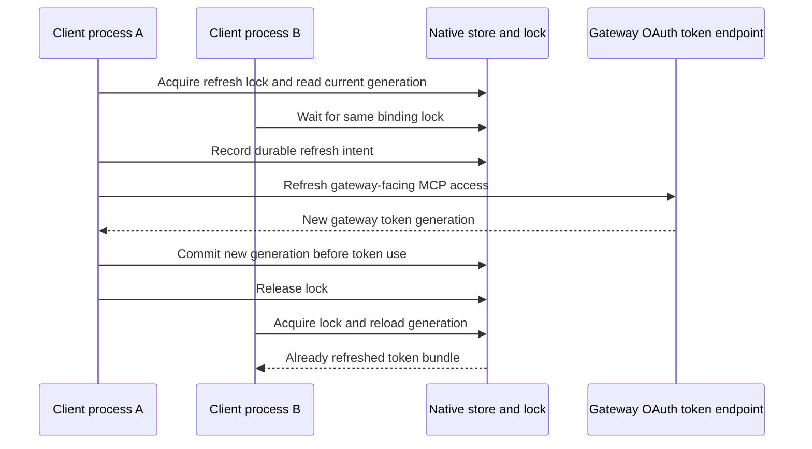

## Active refresh and idle sign-in are different outcomes

The observed deployment issues one-hour gateway-facing MCP access tokens and five-minute upstream Keycloak access tokens. Keycloak also has a 30-minute SSO idle limit, and the observed upstream refresh grants expired after 30 minutes without renewal. The gateway cannot use an expired upstream refresh grant merely because the harness still holds a valid gateway credential. Inference sign-in and MCP sign-in may both need renewal after prolonged inactivity.

Release acceptance therefore exercises normal active use across real frontend expiry: periodic authorized reads maintain the shorter sessions, those reads must not change the frontend token early, and two concurrent fresh processes then run after its expiration. The initial silent-hour test failed because it exceeded the existing idle policy. No wider session lifetime or offline grant was enabled to conceal that limit.

## A login creates a credential lifecycle

Access tokens are short lived. Refresh tokens let the client obtain a new generation without repeating the whole browser flow. The reviewed upstream MCP access-token limit is 300 seconds, with five seconds of validation clock tolerance. The observed gateway-facing opaque MCP access token lasts 3,600 seconds. Treat those numbers as deployment settings, not OAuth defaults.

Inference and MCP have separate credential implementations. Inference uses the harness identity store. Gateway-facing MCP uses the existing Codex OAuth client and its native credential store. The gateway holds and refreshes upstream MCP tokens independently. Concurrent refresh is an acceptance requirement: two fresh harness processes must obtain usable credentials after expiry without an additional browser login. The diagram below describes the coordination design; the measured release behavior and enabled configuration belong in the implementation-status record.

If gateway-facing refresh succeeded but local persistence failed, the old refresh token may already be consumed. The alpha.15 candidate records durable intent before either human credential exchange. It saves the returned generation before using it, and storage retries reuse that returned generation. A lost or uncertain exchange requires sign-in rather than replaying a potentially consumed refresh token. The inference and native MCP stores implement this contract separately.

This state chart describes the alpha.15 candidate's credential lifecycle. Restoring an active credential does not by itself restore permission to continue an old conversation: inference verifies identity continuity, while a fresh gateway MCP login requires a new conversation.

```mermaid
stateDiagram-v2
    accTitle: Candidate human credential lifecycle states
    accDescr: A verified login activates credentials. Refresh enters a durable pending state. A successful commit returns to active; ambiguous interruption requires login. Local logout removes the saved session.
    [*] --> SignedOut
    SignedOut --> Active: Browser login and durable commit
    Active --> RefreshPending: Lock and record intent
    RefreshPending --> Active: Commit new generation
    RefreshPending --> LoginRequired: Interrupted or ambiguous refresh
    RefreshPending --> SignedOut: Logout wins over late completion
    Active --> LoginRequired: Refresh rejected or identity mismatch
    Active --> SignedOut: Local logout
    LoginRequired --> Active: New verified browser login
```

## Alpha.15 recovery work

The next candidate preserves the 30-minute SSO idle limit. It renews credentials when work needs them; an idle terminal does not generate keepalive traffic. Returning after the refresh grant expires requires sign-in. Device authorization and browser SSO differ in how initial authorization is completed, not in this renewal requirement.

The merged alpha.15 candidate records durable native MCP refresh intent and coordinates shared credentials across environment homes. Its inference recovery interface has passed scoped authentication and terminal tests; acceptance of the exact release packages is still pending. A returned token generation is saved before use; local storage retries reuse that generation rather than repeating the rotating exchange. A rejected or uncertain exchange requires sign-in, while a pre-dispatch discovery outage preserves the unconsumed grant. A locked native store needs storage repair, not an unrelated new SSO session.

The candidate's inference recovery uses `/signin`, or `airs-harness login --restore-session --no-browser` in another terminal with the same selected environment. Restore verifies the original issuer, subject, client and audience before saving credentials. It preserves the open conversation and draft, and leaves retrying the request to the user. Ordinary login and logout remain separate session boundaries. These commands describe candidate behavior, not the published alpha.14 interface.

Gateway-facing MCP credentials are separate. The observed opaque gateway token does not provide a verified account-continuity contract to the native client. The candidate therefore stops an MCP authentication failure before model-driven credential fallback, gives the bound gateway MCP login command, and directs the user to a fresh conversation. Automatic restoration of the old MCP conversation is still gated on trusted identity evidence. Backend management-API service-account failures are not treated as human sign-in failures.

The implementation-status lesson records what is merged, deployed and still awaiting exact-package acceptance.

## Refresh cannot expand the grant

A historical direct-route expiry test found that the MCP SDK appended `offline_access` during refresh because Keycloak advertised support for it. This client had never requested or received that scope, so Keycloak rejected the refresh. Initial login and tool calls had succeeded; only waiting for expiry exposed the defect.

The integration now prevents that automatic addition when the saved grant lacks `offline_access`. An existing grant that includes it is preserved. The regression test inspects the SDK’s actual HTTP refresh request, including its resource indicator. Server support, client registration and the permissions granted in a particular login are three different facts. A refresh request must remain within the original grant. [OAuth refresh requirements, RFC 6749 section 6](https://www.rfc-editor.org/rfc/rfc6749#section-6).

Full lifecycle acceptance requires two actual gateway-facing expiration intervals with concurrent fresh native processes. Alpha.14 shipped under a recorded exception with zero completed frontend cycles; that exception is not evidence for later releases. It compares native token-generation fingerprints and expiry metadata without publishing credentials, and correlates gateway tool telemetry with upstream calls after the separate five-minute JWT lifetime. Successful initial login alone cannot prove either renewal path. The earlier direct-client result covers neither the CAS chain nor gateway-managed upstream storage.

## Revocation has several clocks

| Change | Effect in this implementation | Delay to consider |
| --- | --- | --- |
| Delete local credentials | This client loses its saved bundle | Does not invalidate copied tokens |
| Revoke Keycloak session/refresh grant | Further refresh is rejected | Existing signed access JWT may remain valid |
| Remove Keycloak role | Newly issued tokens lose the grant | Previously issued claims persist until expiry |
| Remove MCP subject binding | Server rejects that subject after rollout | All serving replicas must load new policy |
| Update a CIE directory membership | Changes context for consumers of that directory | Sync interval, processing, consumer caches, sessions |

Logout is not immediate global invalidation of every self-contained JWT. Built-in `mcp logout` deletes the local gateway-facing credential. It does not revoke the gateway's upstream token bundle, terminate every Keycloak session or invalidate copied tokens. Server-side revocation is a separate operator action. For urgent MCP removal, the operator can remove the server binding and reconcile all replicas, then revoke the IdP sessions/grants.

Inference logout also attempts issuer revocation of the saved refresh token. In the deployed Keycloak 26.2.4, this removes the authenticated client session associated with that token. Other logins sharing the same browser SSO session and inference client can therefore lose renewal access even when their local credential stores are separate. This is distinct from gateway MCP logout and does not imply revoking every organizational application. See the [Keycloak revocation implementation](https://github.com/keycloak/keycloak/blob/26.2.4/services/src/main/java/org/keycloak/protocol/oidc/endpoints/TokenRevocationEndpoint.java).

Parallel acceptance runs must finish their workflows before either performs issuer logout. The test controller coordinates cleanup across Linux and Mac; an early failure still waits for its peer. Unique native MCP keyring names protect local records, while coordinated cleanup protects the shared server-side inference session.

CIE's observed worker schedule is 15 minutes, but that is not a proven maximum deprovisioning time. Failed runs, consumer caching, and already issued credentials affect the full interval. Measure removal at the resource that actually enforces the access.

## Renames and account changes

An email rename changes a lookup attribute. A move to another realm changes the issuer and often the subject. A recreated account can reuse a username while representing a different identity. The inference binding protects its issuer/user/client/resource context. Native MCP login is independent, so verify the selected browser account and the MCP server subject policy when changing identities.

For CIE, verify both the SCIM record and the SAML fields consumed by the gateway. Renaming a group in the reviewed adapter can recreate the destination group, which can affect policy references. Plan an isolated exercise before treating a rename as harmless metadata maintenance.

**Checkpoint:** Alex signs out at 12:00 with an access JWT expiring at 12:04. Can an offline-validating server still accept that JWT before expiry? It may, unless another server-side control removes access sooner.

Implementation and measured acceptance: [Implementation status and public sources](./evidence.md).
