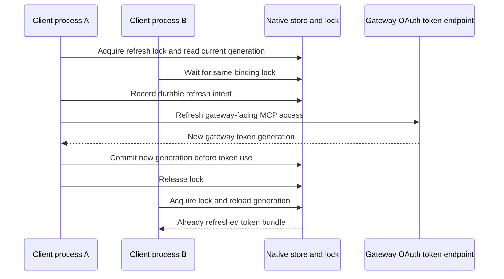

```mermaid
stateDiagram-v2
    accTitle: Candidate human credential lifecycle states
    accDescr: A verified login activates credentials. Refresh enters a durable pending state. A successful commit returns to active; ambiguous interruption requires login. Local logout removes the saved session.
    [*] --> SignedOut
    SignedOut --> Active: Browser login and durable commit
    Active --> RefreshPending: Lock and record intent
    RefreshPending --> Active: Commit new generation
    RefreshPending --> LoginRequired: Interrupted or ambiguous refresh
    RefreshPending --> SignedOut: Logout wins over late completion
    Active --> LoginRequired: Refresh rejected or identity mismatch
    Active --> SignedOut: Local logout
    LoginRequired --> Active: New verified browser login
```

## A login creates a credential lifecycle

The login lesson ends with credentials saved in a native store. That is the start of a lifecycle, because every credential in this system expires on its own clock. If you are used to API keys, the adjustment is that nothing here is a long-lived secret you paste once. An access token is short lived by design, and a refresh token exists so the client can obtain a new generation without repeating the whole browser flow. The lifetimes in this case study are deployment settings, not OAuth defaults: the reviewed upstream MCP access-token limit is 300 seconds, with five seconds of validation clock tolerance, and the observed gateway-facing opaque MCP access token lasts 3,600 seconds.

There is not one lifecycle but three, because inference and MCP have separate credential implementations and the gateway has its own. Inference uses the harness identity store. Gateway-facing MCP uses the existing Codex OAuth client and its native credential store. The gateway holds and refreshes upstream MCP tokens independently, so the harness never handles them. A valid credential in one store tells you nothing about the other two.

Refresh is also where concurrency enters. Two fresh harness processes must obtain usable credentials after expiry without an additional browser login; that is an acceptance requirement for the release. The difficulty is that a rotating refresh token can be exchanged only once, so two processes that both try to refresh the same binding would race, and the loser would present a consumed token. The diagram below describes the coordination design that avoids the race. The measured release behavior and enabled configuration belong in the implementation-status record.

The lock alone is not enough, because the dangerous moment is between the exchange and the save. If the gateway-facing refresh succeeded but local persistence failed, the old refresh token may already be consumed. The client therefore records durable intent before either human credential exchange, saves the returned generation before using it, and lets storage retries reuse that returned generation rather than asking the gateway again. When the outcome of an exchange is lost or uncertain, the safe answer is sign-in, not a replay of a potentially consumed refresh token. The inference and native MCP stores implement this contract separately.

The state chart below describes the native credential lifecycle. One transition is easy to misread: restoring an active credential does not by itself restore permission to continue an old conversation. Inference verifies identity continuity before the conversation continues, while a fresh gateway MCP login requires a new conversation.

## Active refresh and idle sign-in are different outcomes

The observed deployment issues one-hour gateway-facing MCP access tokens and five-minute upstream Keycloak access tokens. Keycloak also has a 30-minute SSO idle limit, and the observed upstream refresh grants expired after 30 minutes without renewal. So a user who keeps working keeps the shorter sessions alive as refresh keeps pace with expiry, while a user who walks away for half an hour comes back to a grant that can no longer be renewed. The gateway cannot use an expired upstream refresh grant merely because the harness still holds a valid gateway credential; the two clocks are independent. After prolonged inactivity, inference sign-in and MCP sign-in may both need renewal.

Release acceptance therefore has to exercise both outcomes rather than one. It runs normal active use across real frontend expiry: ordinary authorized utility calls maintain the shorter sessions, those calls must not change the frontend token early, and two concurrent fresh processes then run after its expiration. The terminal preserves the 30-minute idle policy. Actual user activity is the active-use test. An idle terminal does not send synthetic keepalive traffic, because idle expiry is an intended policy outcome rather than a defect to work around.

## Returning after idle

When inference sign-in is needed, the terminal should preserve the conversation and draft, present company sign-in and let the user retry the request. Native-store and temporary network failures are different problems and retain their distinct guidance, so a locked keyring does not send the user to re-authenticate. A new gateway MCP login still requires a fresh conversation when trusted identity continuity is unavailable, and completed tools are not automatically replayed.

The case study has one dated observation of this path. The maintainer observed manual recovery in alpha.15: after about 30 minutes idle, `/signin` restored the same verified identity and the next inference reply in the existing conversation. The automatic prompt had not appeared, because a provider-routing bug hid it behind a generic fatal helper error. Alpha.16 includes the routing fix, with a regression through the real helper dispatch path. That establishes the source correction and the manual path. It does not by itself establish automatic guidance for every production renewal case.

## Recovery behavior in the reviewed client

The client preserves the 30-minute SSO idle limit. It renews credentials when work needs them; an idle terminal does not generate keepalive traffic. Returning after the refresh grant expires requires sign-in. Device authorization and browser SSO differ in how initial authorization is completed, not in this renewal requirement.

For native MCP, the client records durable refresh intent and coordinates shared credentials across environment homes. Its inference recovery interface has passed scoped authentication and terminal tests; full production lifecycle acceptance remains incomplete. A returned token generation is saved before use, local storage retries reuse that generation rather than repeating the rotating exchange, and a rejected or uncertain exchange requires sign-in. Two failure cases are not credential failures at all. A pre-dispatch discovery outage preserves the unconsumed grant, since nothing was exchanged. A locked native store needs storage repair, not an unrelated new SSO session.

Inference recovery uses `/signin`, or `airs login --restore-session --no-browser` in another terminal with the same selected environment. Restore is not a blind reload: it verifies the original issuer, subject, client and audience before saving credentials. It preserves the open conversation and draft, and leaves retrying the request to the user. Ordinary login and logout remain separate session boundaries. The maintainer exercised manual restoration in alpha.15; alpha.16 adds the normal provider path to the automatic sign-in guidance.

Gateway-facing MCP credentials follow a stricter rule, and the reason is the token format. The observed opaque gateway token does not provide a verified account-continuity contract to the native client, so the client has no trustworthy way to confirm that a new login belongs to the same person. It therefore stops an MCP authentication failure before model-driven credential fallback, gives the bound gateway MCP login command, and directs the user to a fresh conversation. Automatic restoration of the old MCP conversation is still gated on trusted identity evidence. mcp server 1's tools have no downstream service-account credential to renew, so there is no server-side credential to restore.

The implementation-status lesson records what is merged, deployed and still awaiting exact-package acceptance.

## Refresh cannot expand the grant

A refresh request must remain within the original grant, and a historical direct-route expiry test shows how easy it is to violate that without noticing. The MCP SDK appended `offline_access` during refresh because Keycloak advertised support for it. This client had never requested or received that scope, so Keycloak rejected the refresh. Initial login and tool calls had all succeeded; only waiting for expiry exposed the defect, which is why a lifecycle test that stops at first login proves less than it appears to.

The integration now prevents that automatic addition when the saved grant lacks `offline_access`, while an existing grant that includes it is preserved. The regression test inspects the SDK’s actual HTTP refresh request, including its resource indicator, rather than trusting what the library intended to send. The general lesson is that server support, client registration and the permissions granted in a particular login are three different facts. [OAuth refresh requirements, RFC 6749 section 6](https://www.rfc-editor.org/rfc/rfc6749#section-6).

The same reasoning sets the bar for lifecycle acceptance. Full lifecycle acceptance requires two actual gateway-facing expiration intervals with concurrent fresh native processes. Alpha.14 shipped under a recorded exception with zero completed frontend cycles; that exception is not evidence for later releases. The acceptance compares native token-generation fingerprints and expiry metadata without publishing credentials, and correlates gateway tool telemetry with upstream calls after the separate five-minute JWT lifetime. Successful initial login alone cannot prove either renewal path, and the earlier direct-client result covers neither the CAS chain nor gateway-managed upstream storage.

## Revocation has several clocks

If you expect revocation to take effect everywhere at once, this system will surprise you. "Revoke" can mean five different actions here, and each takes effect at a different place after a different delay.

| Change | Effect in this implementation | Delay to consider |
| --- | --- | --- |
| Delete local credentials | This client loses its saved bundle | Does not invalidate copied tokens |
| Revoke Keycloak session/refresh grant | Further refresh is rejected | Existing signed access JWT may remain valid |
| Remove Keycloak role | Newly issued tokens lose the grant | Previously issued claims persist until expiry |
| Remove MCP subject binding | Server rejects that subject after rollout | All serving replicas must load new policy |
| Update a CIE directory membership | Changes context for consumers of that directory | Sync interval, processing, consumer caches, sessions |

The consequence is that logout is not immediate global invalidation of every self-contained JWT. Built-in `mcp logout` deletes the local gateway-facing credential. It does not revoke the gateway's upstream token bundle, terminate every Keycloak session or invalidate copied tokens. Server-side revocation is a separate operator action. For urgent MCP removal, the operator can remove the server binding and reconcile all replicas, then revoke the IdP sessions/grants. The binding is enforced by the resource server itself, which is why it is the first thing to remove.

Inference logout goes one step further than MCP logout: it also attempts issuer revocation of the saved refresh token. In the deployed Keycloak 26.2.4, this removes the authenticated client session associated with that token. Other logins sharing the same browser SSO session and inference client can lose renewal access even when their local credential stores are separate. This is distinct from gateway MCP logout and does not imply revoking every organizational application. See the [Keycloak revocation implementation](https://github.com/keycloak/keycloak/blob/26.2.4/services/src/main/java/org/keycloak/protocol/oidc/endpoints/TokenRevocationEndpoint.java).

That side effect shapes how the acceptance tests run. Parallel acceptance runs must finish their workflows before either performs issuer logout. The test controller coordinates cleanup across Linux and Mac; an early failure still waits for its peer. Unique native MCP keyring names protect local records, while coordinated cleanup protects the shared server-side inference session.

CIE deprovisioning has its own propagation path. Its observed worker schedule is 15 minutes, but that is not a proven maximum deprovisioning time. Failed runs, consumer caching, and already issued credentials all extend the full interval. Measure removal at the resource that actually enforces the access, not at the directory.

## Renames and account changes

Identity changes can look like metadata edits, but several of them change which identity a token represents. An email rename changes a lookup attribute. A move to another realm changes the issuer and often the subject. A recreated account can reuse a username while representing a different identity. The inference binding protects its issuer/user/client/resource context, so it notices the difference. Native MCP login is independent, so verify the selected browser account and the MCP server subject policy when changing identities.

For CIE, verify both the SCIM record and the SAML fields consumed by the gateway. Renaming a group in the reviewed adapter can recreate the destination group, which can affect policy references. Plan an isolated exercise before treating a rename as harmless metadata maintenance.

**Checkpoint:** Alex signs out at 12:00 with an access JWT expiring at 12:04. Can an offline-validating server still accept that JWT before expiry? It may. The server validates the signature and expiry locally and does not ask the issuer whether the session still exists, so unless another server-side control removes access sooner, the token stays acceptable until 12:04.

Implementation and measured acceptance: [Implementation status and public sources](./evidence.md).
