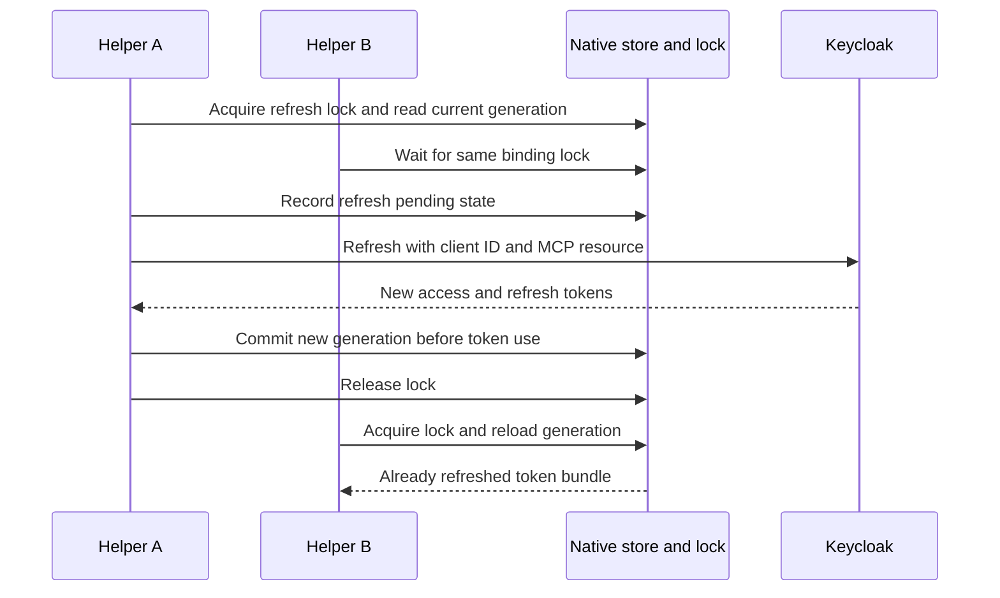

```mermaid
stateDiagram-v2
    accTitle: Inference credential lifecycle states
    accDescr: A verified login activates credentials. Refresh enters a durable pending state. A successful commit returns to active; ambiguous interruption requires login. Local logout removes the saved session.
    [*] --> SignedOut
    SignedOut --> Active: Browser login and durable commit
    Active --> RefreshPending: Lock and record intent
    RefreshPending --> Active: Commit new generation
    RefreshPending --> LoginRequired: Interrupted or ambiguous refresh
    Active --> LoginRequired: Refresh rejected or identity mismatch
    Active --> SignedOut: Local logout
    LoginRequired --> Active: New verified browser login
```

## A login creates a credential lifecycle

Access tokens are short lived. Refresh tokens let the client obtain a new generation without repeating the whole browser flow. The reviewed MCP access-token limit is 300 seconds, with five seconds of validation clock tolerance. Treat those numbers as deployment settings, not OAuth defaults.

The harness persists credentials transactionally. A refresh token can be consumed only once under the configured rotation policy. Two fresh helper processes must coordinate before refreshing the same bundle.

If refresh succeeded at Keycloak but local persistence failed, the old refresh token may already be consumed. The implementation requires login after an interrupted refresh rather than guessing that replay is safe. A durable pending record makes that ambiguity visible across process restarts.

## Revocation has several clocks

| Change | Effect in this implementation | Delay to consider |
| --- | --- | --- |
| Delete local credentials | This client loses its saved bundle | Does not invalidate copied tokens |
| Revoke Keycloak session/refresh grant | Further refresh is rejected | Existing signed access JWT may remain valid |
| Remove Keycloak role | Newly issued tokens lose the grant | Previously issued claims persist until expiry |
| Remove MCP subject binding | Server rejects that subject after rollout | All serving replicas must load new policy |
| Update a CIE directory membership | Changes context for consumers of that directory | Sync interval, processing, consumer caches, sessions |

Logout is not immediate global invalidation of every self-contained JWT. The recorded lifecycle test observed refresh rejection after logout, followed by access-token rejection after the configured expiry window. For urgent MCP removal, the operator can remove the server binding and reconcile all replicas, then revoke the IdP sessions/grants.

CIE's observed worker schedule is 15 minutes, but that is not a proven maximum deprovisioning time. Failed runs, consumer caching, and already issued credentials affect the full interval. Measure removal at the resource that actually enforces the access.

## Renames and account changes

An email rename changes a lookup attribute. A move to another realm changes the issuer and often the subject. A recreated account can reuse a username while representing a different identity. The harness's binding includes issuer/user/client/resource context; it must not silently transfer a previous user's saved environment to a new identity.

For CIE, verify both the SCIM record and the SAML fields consumed by the gateway. Renaming a group in the reviewed adapter can recreate the destination group, which can affect policy references. Plan an isolated exercise before treating a rename as harmless metadata maintenance.

**Checkpoint:** Alex signs out at 12:00 with an access JWT expiring at 12:04. Can an offline-validating server still accept that JWT before expiry? It may, unless another server-side control removes access sooner.

Implementation and measured acceptance: [Implementation status and public sources](./evidence.md).
