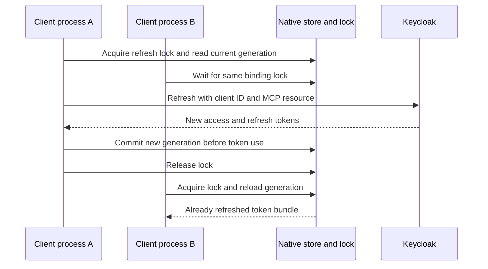

## A login creates a credential lifecycle

Access tokens are short lived. Refresh tokens let the client obtain a new generation without repeating the whole browser flow. The reviewed MCP access-token limit is 300 seconds, with five seconds of validation clock tolerance. Treat those numbers as deployment settings, not OAuth defaults.

Inference and MCP have separate credential implementations. Inference uses the harness identity store. MCP uses the existing Codex OAuth client and its native credential store. Concurrent refresh is an acceptance requirement: two fresh harness processes must obtain usable credentials after expiry without an additional browser login. The diagram below describes the coordination design; the measured release behavior and enabled configuration belong in the implementation-status record.

If refresh succeeded at Keycloak but local persistence failed, the old refresh token may already be consumed. Do not assume a lost successful refresh can safely be replayed. The inference store has a durable pending-state mechanism; the separate Codex MCP implementation must be evaluated on its own behavior. Login is the recovery path when the saved refresh credential is rejected.

This state chart describes the harness inference store. It must not be read as a claim that the stock MCP store has the same durable pending-state mechanism.

```mermaid
stateDiagram-v2
    accTitle: Inference credential lifecycle states
    accDescr: A verified login activates credentials. Refresh enters a durable pending state. A successful commit returns to active; ambiguous interruption requires login. Local logout removes the saved session.
    [*] --> SignedOut
    SignedOut --> Active: Browser login and durable commit
    Active --> RefreshPending: Lock and record intent
    RefreshPending --> Active: Commit new generation
    RefreshPending --> LoginRequired: Interrupted or ambiguous refresh
    Active --> LoginRequired: Refresh rejected or identity mismatch
    Active --> SignedOut: Local logout
    LoginRequired --> Active: New verified browser login
```

## Refresh cannot expand the grant

A real expiry test found that the MCP SDK appended `offline_access` during refresh because Keycloak advertised support for it. This client had never requested or received that scope, so Keycloak rejected the refresh. Initial login and tool calls had succeeded; only waiting for expiry exposed the defect.

The integration now prevents that automatic addition when the saved grant lacks `offline_access`. An existing grant that includes it is preserved. The regression test inspects the SDK’s actual HTTP refresh request, including its resource indicator. Server support, client registration and the permissions granted in a particular login are three different facts. A refresh request must remain within the original grant. [OAuth refresh requirements, RFC 6749 section 6](https://www.rfc-editor.org/rfc/rfc6749#section-6).

## Revocation has several clocks

| Change | Effect in this implementation | Delay to consider |
| --- | --- | --- |
| Delete local credentials | This client loses its saved bundle | Does not invalidate copied tokens |
| Revoke Keycloak session/refresh grant | Further refresh is rejected | Existing signed access JWT may remain valid |
| Remove Keycloak role | Newly issued tokens lose the grant | Previously issued claims persist until expiry |
| Remove MCP subject binding | Server rejects that subject after rollout | All serving replicas must load new policy |
| Update a CIE directory membership | Changes context for consumers of that directory | Sync interval, processing, consumer caches, sessions |

Logout is not immediate global invalidation of every self-contained JWT. Built-in `mcp logout` deletes local MCP credentials. It does not promise to revoke the Keycloak session or invalidate a copied refresh token. Server-side revocation is a separate operator action. For urgent MCP removal, the operator can remove the server binding and reconcile all replicas, then revoke the IdP sessions/grants.

CIE's observed worker schedule is 15 minutes, but that is not a proven maximum deprovisioning time. Failed runs, consumer caching, and already issued credentials affect the full interval. Measure removal at the resource that actually enforces the access.

## Renames and account changes

An email rename changes a lookup attribute. A move to another realm changes the issuer and often the subject. A recreated account can reuse a username while representing a different identity. The inference binding protects its issuer/user/client/resource context. Native MCP login is independent, so verify the selected browser account and the MCP server subject policy when changing identities.

For CIE, verify both the SCIM record and the SAML fields consumed by the gateway. Renaming a group in the reviewed adapter can recreate the destination group, which can affect policy references. Plan an isolated exercise before treating a rename as harmless metadata maintenance.

**Checkpoint:** Alex signs out at 12:00 with an access JWT expiring at 12:04. Can an offline-validating server still accept that JWT before expiry? It may, unless another server-side control removes access sooner.

Implementation and measured acceptance: [Implementation status and public sources](./evidence.md).
