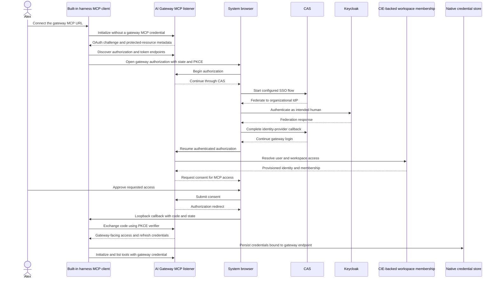

## Authenticate for the gateway destination

From Alex's chair, signing in looks like one event: a browser opens, Keycloak asks for a password once, and afterwards both the model and mcp server 1 respond. Underneath, there are separate grants, and this lesson is about seeing them separately, because when one of them expires or is denied, the other keeps working and the symptom only makes sense if you know which grant failed.

Both inference and MCP must target Prisma AIRS AI Gateway. The sequences below separate the native gateway login, which the harness performs, from the gateway-owned upstream login, which the gateway performs on Alex's behalf. An existing Keycloak browser session can make both feel like one sign-in. It does not make them one grant.

The inference leg is the simpler one, and it is already in place in the case study. A user signs in to Keycloak using the configured native-client flow and presents a gateway-authorized JWT. A workspace API key is a separate supported authentication mode for inference; it does not require converting the key into a Keycloak token. Nothing in the MCP work below changes the inference leg, so a working inference environment stays as it is while MCP is brought onto the gateway path.

## Native MCP login through the gateway

The native MCP login is the longer sequence because three parties take part in authenticating Alex: the gateway that will issue the credential, CAS that runs the organizational sign-in, and Keycloak that actually verifies the person. Read it top to bottom and notice that the client only ever talks to the gateway and the browser.



The sequence starts with a failure on purpose. The client initializes without a credential, the gateway answers with an OAuth challenge and protected-resource metadata, and that metadata is how the client learns where to authorize and where to exchange the code. The browser then carries Alex through CAS to Keycloak and back. After the gateway has a verified identity, it resolves workspace membership from the CIE-backed directory, asks for consent, and only then redirects to the loopback callback with a code. The PKCE exchange turns that code into gateway-facing credentials, which the client stores bound to the gateway endpoint before using them to list tools.

CAS is the gateway-facing user-authentication method in SCM deployments. The diagram shows the shape of the flow; the actual callback, client registration, token issuer, audience and scopes must be verified from the gateway's discovery and deployed configuration rather than assumed from the picture. One inference to resist: Keycloak appeared during federation, but that does not establish that the resulting MCP token is the same JWT used for inference. It was issued by the gateway for the gateway. [OAuth in SCM](https://portkey.ai/docs/product/mcp-gateway/authentication/cas).

If an operator selects the gateway's External OAuth mode instead, the browser hop changes: the harness presents a Keycloak-issued token using the configured gateway authentication contract. The destination does not change. It still targets the gateway, and switching to a direct upstream URL is never the fallback for a failed gateway login, because the upstream would not accept the client's credential anyway.

## Upstream OAuth remains with the gateway

The first sequence got Alex to the gateway. It did not get anything to mcp server 1, which has its own authorization server and its own idea of who Alex is. That second leg belongs to the gateway.

```mermaid
sequenceDiagram
    accTitle: Separate gateway-managed upstream MCP authorization
    accDescr: The gateway discovers upstream OAuth and coordinates the user's consent. The upstream authorization server issues tokens to the gateway, which stores them and uses them for proxied MCP requests. The harness retains only its gateway-facing credentials.
    participant client as Harness
    participant gateway as AI Gateway
    participant browser as User browser
    participant upstream as mcp server 1
    participant auth as Upstream authorization server
    client->>gateway: Request access to provisioned MCP tools
    gateway->>upstream: Discover upstream authentication requirements
    upstream-->>gateway: Protected resource and authorization metadata
    gateway-->>browser: Upstream consent flow when required
    browser->>auth: Authenticate and approve upstream access
    auth-->>browser: Redirect with authorization code
    browser->>gateway: Gateway upstream OAuth callback
    gateway->>auth: Exchange code with configured client authentication
    auth-->>gateway: Upstream access and refresh tokens
    gateway->>gateway: Store tokens for this upstream and user
    gateway->>upstream: Proxied MCP request with upstream credential
    upstream-->>gateway: Authorized MCP response
    gateway-->>client: MCP response
```



Compare the two callbacks. In the first sequence the code came back to the harness on loopback. Here it comes back to the gateway, the gateway exchanges it using its own configured client authentication, and the resulting upstream access and refresh tokens are stored at the gateway for this upstream and this user. The harness never holds them; it holds only its gateway-facing credentials.

The exact consent trigger and order depend on the registered upstream integration, so expect variation between integrations. Gateway OAuth Auto and machine client credentials are distinct modes. A failure in the machine mode does not demonstrate that OAuth Auto is unavailable. The gateway manages upstream OAuth, and the harness must not acquire upstream tokens to bypass that step, since doing so would move a credential the architecture keeps server-side onto the workstation. [MCP authentication layers](https://portkey.ai/docs/product/mcp-gateway/authentication).

## Native onboarding

With the model in place, the onboarding commands are short. Use the connection URL returned by the gateway for the workspace integration. An illustrative production destination is `https://gateway-mcp.example.com/mcp-server-1/mcp`; a development integration might end in `/mcp-server-1-dev/mcp`. Replace these examples with the connection URLs from your gateway. The upstream resource URL is configured only on the gateway, so the harness never needs it.

With the gateway integration and workspace membership provisioned, configure native credential storage in the selected harness environment and add the server:

```toml
mcp_oauth_credentials_store = "keyring"
```

```sh
airs-harness mcp add mcp-server-1 \
  --url https://gateway-mcp.example.com/mcp-server-1/mcp \
  --scopes mcp:servers:read,mcp:tools:list,mcp:tools:call
airs-harness mcp list
airs-harness doctor --verify-access
```

`mcp add` performs the first sequence: it discovers gateway OAuth, dynamically registers the public native client, and starts browser authorization. After a cancelled or expired attempt, use `airs-harness mcp login mcp-server-1`. Run `/mcp` inside the interactive harness to inspect the available tools. The CLI identifier `mcp-server-1` is an example connection name for mcp server 1; use the actual gateway-provided URL and the discovered scopes. Changing the documentation label does not rename an existing saved connection or deployment. Upstream client IDs and secrets remain in the gateway integration.

The credential store adds platform conditions of its own. On macOS, perform login in the signed-in desktop session and allow the native Keychain prompt. A browser success page confirms the callback, but the CLI must also confirm that credentials were saved, because the save is a separate step that can fail after the browser has finished. Under SSH, Keychain may refuse access with “User interaction is not allowed.” Linux requires an unlocked native Secret Service session. The loopback callback times out after five minutes, after which a fresh login attempt is required; returning to an old browser tab cannot complete a new attempt because the state and verifier belong to the earlier one.

Verify OAuth discovery, browser callback, gateway access, tool discovery and a model-selected utility call as separate steps, since each can succeed while the next fails. Then test expiry, logout and denial on the gateway-mediated path. A server inventory alone does not establish any of these results. Notice too that the scopes in the command above belong to the gateway-facing OAuth leg; the upstream resource grant is utilities.use, and it is issued in the second sequence, not this one.

Continue with [End-to-end question walkthrough](./walkthrough.md) and [Implementation status and public sources](./evidence.md).
