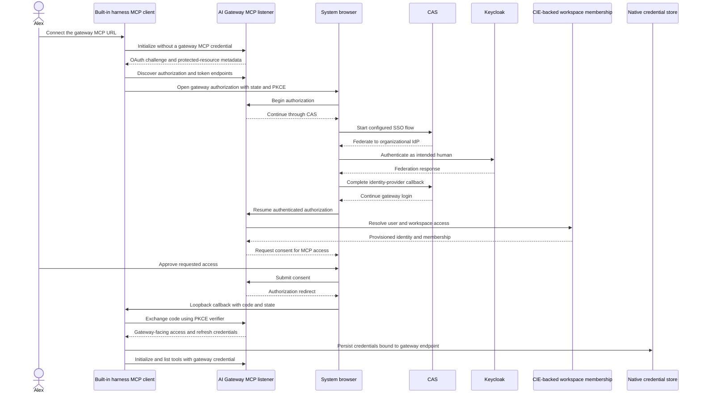
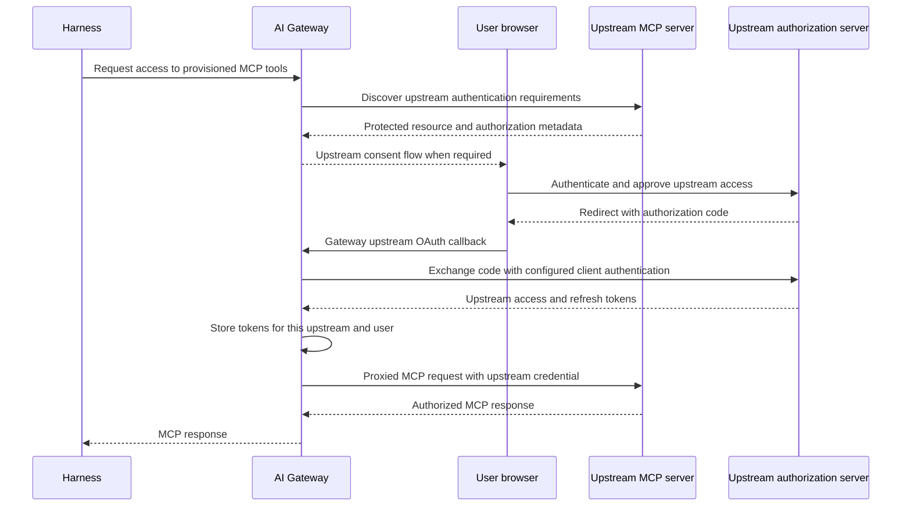

## Authenticate for the gateway destination

Both inference and MCP must target Prisma AIRS AI Gateway. The sequences below separate the native gateway login from the gateway-owned upstream login. An existing Keycloak browser session can make both feel like one sign-in, but they create separate grants.

For inference, a user signs in to Keycloak using the configured native-client flow and presents a gateway-authorized JWT. A workspace API key is a separate supported authentication mode; it does not require converting the key into a Keycloak token. Preserve the working inference environment while correcting MCP.

## Native MCP login through the gateway



CAS is the gateway-facing user-authentication method in SCM deployments. The actual callback, client registration, token issuer, audience and scopes must be verified from the gateway's discovery and deployed configuration. A Keycloak login during federation does not establish that the resulting MCP token is the same JWT used for inference. [OAuth in SCM](https://portkey.ai/docs/product/mcp-gateway/authentication/cas).

If an operator selects the gateway's External OAuth mode instead, the harness presents a Keycloak-issued token using the configured gateway authentication contract. It still targets the gateway. Switching to a direct upstream URL is never the fallback for a failed gateway login.

## Upstream OAuth remains with the gateway



The exact consent trigger and order depend on the registered upstream integration. Gateway OAuth Auto and machine client credentials are distinct modes. A failure in the latter does not demonstrate that the former is unavailable. The gateway manages upstream OAuth; the harness must not acquire upstream tokens to bypass that step. [MCP authentication layers](https://portkey.ai/docs/product/mcp-gateway/authentication).

## Native onboarding

Use the connection URL returned by the gateway for the workspace integration. An illustrative production destination is `https://gateway-mcp.example.com/prisma-airs/mcp`; a development integration might end in `/prisma-airs-dev/mcp`. Replace these examples with the connection URLs from your gateway. The upstream resource URL is configured only on the gateway.

With the gateway integration and workspace membership provisioned, configure native credential storage in the selected harness environment and add the server:

```toml
mcp_oauth_credentials_store = "keyring"
```

```sh
airs-harness mcp add prisma-airs \
  --url https://gateway-mcp.example.com/prisma-airs/mcp \
  --scopes mcp:servers:read,mcp:tools:list,mcp:tools:call
airs-harness mcp list
airs-harness doctor --verify-access
```

`mcp add` discovers gateway OAuth, dynamically registers the public native client, and starts browser authorization. After a cancelled or expired attempt, use `airs-harness mcp login prisma-airs`. Run `/mcp` inside the interactive harness to inspect the available tools. No upstream client ID, client secret, bearer header helper or second binary belongs in this configuration.

On macOS, perform login in the signed-in desktop session and allow the native Keychain prompt. A browser success page confirms the callback, but the CLI must also confirm that credentials were saved. Under SSH, Keychain may refuse access with “User interaction is not allowed.” Linux requires an unlocked native Secret Service session. A five-minute loopback callback timeout requires a fresh login attempt; returning to an old browser tab cannot complete a new attempt.

Verify OAuth discovery, browser callback, gateway access, tool discovery and a model-selected read as separate steps. Then test expiry, logout and denial on the gateway-mediated path. Existing direct-server credentials and the direct-path fixture tests do not establish these results.

Continue with [End-to-end question walkthrough](./walkthrough.md) and [Implementation status and public sources](./evidence.md).
