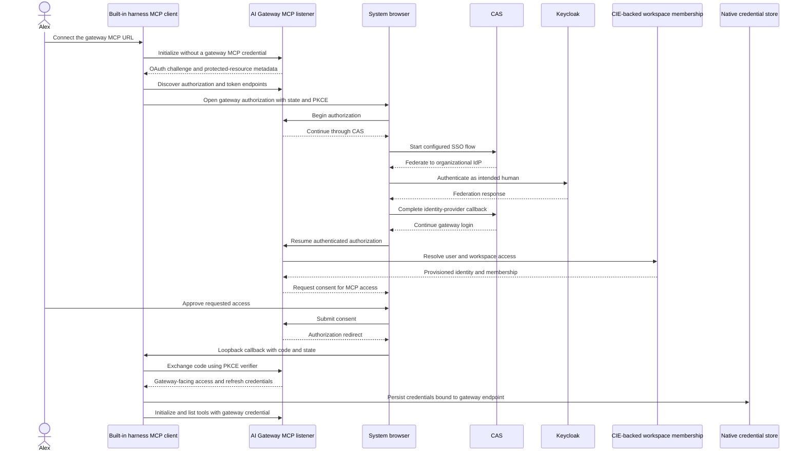
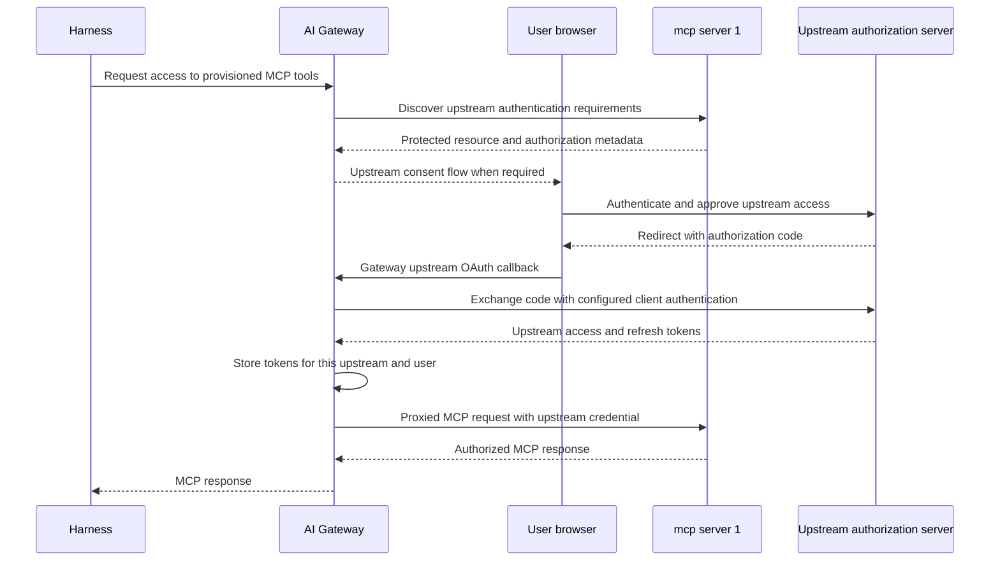

## SSO to ServiceNow: a complete first session

The outcome is concrete: you sign into the harness as yourself, connect the ServiceNow MCP integration in the same environment, and ask the agent to read an incident. Your company SSO identity is used throughout the human login steps. Inference and MCP still receive separate credentials, and the ServiceNow backend uses a server-side integration account.

**Command availability:** this walkthrough targets **airs-harness 0.1.0-alpha.22**, invoked as `airs`, with **Prisma AIRS CLI 7.0.0** bundled as `airs cli`. The npm package keeps the name `airs-harness`. Existing environments, credentials and histories do not need to be recreated. Top-level `setup` and `status` are removed; use `env create` and `env status`.

Use your organization's package registry (the URL below is an example), then verify the installed commands:

```sh
npm install -g airs-harness@0.1.0-alpha.22 --include=optional --registry=https://npm.example.com
airs --version
airs cli --version
airs env create --help
```

Use Node.js 22.14 or later in the 22.x line, or Node.js 24 or newer. A fresh machine needs only the harness installation above; the product CLI and its skills ship with it. You do not need a global `airs-cli` installation to use `airs cli`.

**If this machine already has the old standalone CLI:** upgrade it first so it releases the `airs` command, then install the harness. Do not force npm to overwrite a command owned by another package.

```sh
npm install -g @cdot65/prisma-airs-cli@7.0.0 --registry=https://registry.npmjs.org
airs-cli --version
npm install -g airs-harness@0.1.0-alpha.22 --include=optional --registry=https://npm.example.com
airs --version
airs cli --version
airs --migration-check
```

Run `type -a airs airs-cli airs-harness` in your shell if another executable or alias shadows the npm commands; after changing PATH, refresh your shell's command cache or start a new shell. `airs --migration-check` reports executable ownership without modifying it. For a check before installation, run `npm exec --yes --registry=https://npm.example.com --package=airs-harness@0.1.0-alpha.22 -- airs --migration-check`. Move an obsolete manual command aside only after identifying its owner.

The compatibility alias `airs-harness` remains for alpha.22 and is scheduled for removal in alpha.23. Update scripts now: harness commands start with `airs`; product commands start with `airs cli` or standalone `airs-cli`. For example, old `airs runtime ...` becomes `airs cli runtime ...`.

### 1. Get the connection details and access

Ask your administrator for these public connection settings. The values below are examples, not a live tenant configuration.

| Setting | Example | Used for |
| --- | --- | --- |
| Inference API URL | `https://gateway.example.com/v1` | Model requests through AI Gateway |
| Company OIDC issuer | `https://sso.example.com/realms/company` | Your inference browser sign-in |
| Public native client ID | `harness-native` | The installed harness; no client secret |
| Inference audience | `airs-inference` | The resource expected in the inference token |
| ServiceNow gateway MCP URL | `https://gateway-mcp.example.com/mcp-service-now-dev/mcp` | Your gateway-mediated ServiceNow connection |

Your account needs inference access, membership in the gateway workspace that exposes ServiceNow, and a ServiceNow MCP subject binding with the appropriate incident permissions. Being able to sign into SSO does not grant those permissions automatically. The administrator provisions the gateway integration and its upstream OAuth client before you add it locally. The example integration targets a ServiceNow development instance.

Use a desktop browser and an available OS credential store. On macOS, sign in from the desktop session and allow Keychain access. On Linux, make sure the Secret Service/keyring session is available and unlocked. Passwords belong in the company browser page, never in a command or configuration file.

### 2. Create and select your environment

```sh
airs env create work --gateway-url https://gateway.example.com/v1
airs env use work
```

Creation already selects `work`; the explicit `env use` makes the rest of the walkthrough's destination clear. Because the gateway URL is supplied, creation does not open a browser. Sign-in is the next step. If `work` already exists and points at the intended gateway, run only `env use work`. Use `env show work` to inspect it; do not recreate it to repair a cancelled login.

For a guided alternative, run `airs env create work` with no gateway flag. Enter the inference URL, choose **1. Company sign-in**, and provide the issuer, public client ID and audience from the table. That wizard combines this step and the next one. After successful sign-in, continue with verification rather than signing in twice.

### 3. Sign into inference with company SSO

```sh
airs --environment work login \
  --issuer-url https://sso.example.com/realms/company \
  --oidc-client-id harness-native \
  --audience airs-inference
```

Sign in as the intended company user in the browser. Return to the terminal and wait for successful credential persistence. A browser success page alone does not prove that the OS store saved the credential. If you cancelled, rerun `airs --environment work login` in the existing environment and choose Company sign-in.

Check the saved identity, then test the inference route:

```sh
airs env status work
airs --environment work doctor --verify-access
```

`env status` inspects local configuration; it does not prove fresh authentication or remote access. `doctor --verify-access` performs an inference probe, which can consume gateway quota. Its success does not test ServiceNow tools. Resolve an inference error before continuing; adding MCP will not repair an incorrect inference URL or missing inference entitlement.

### 4. Add ServiceNow to that same environment

Run `airs env show work` and locate its `state_directory`. In that directory's `config.toml`, set the following **top-level** key before any `[table]` headers, updating an existing value rather than adding a duplicate:

```toml
mcp_oauth_credentials_store = "keyring"
```

This requires native storage for MCP credentials as well. Then register the gateway connection:

```sh
airs --environment work mcp add service-now \
  --url https://gateway-mcp.example.com/mcp-service-now-dev/mcp \
  --scopes mcp:servers:read,mcp:tools:list,mcp:tools:call
```

`service-now` is the local connection name. The URL must be the gateway's ServiceNow connection URL, including the final `/mcp`. It is not the ServiceNow instance URL or the upstream MCP server URL. Adding a server in `work` does not add it to your other environments.

### 5. Complete MCP login with the same company identity

`mcp add` detects OAuth and normally opens the browser immediately. Follow the gateway's CAS/company sign-in flow and select the **same company account** used for inference. An existing SSO browser session may avoid another password prompt; consent or account selection can still appear. If the gateway requests upstream ServiceNow MCP consent, complete that gateway-managed flow with the same company identity too.

Wait for the CLI to report **Successfully logged in.** If adding the connection saved it but login was cancelled, failed or expired, resume without adding it again:

```sh
airs --environment work mcp login service-now
```

Do not run this again just because `mcp add` already completed login successfully. Do not paste the inference token into the MCP configuration, register the upstream confidential client on your workstation, or enter a ServiceNow integration password into the harness. The user authenticates to the gateway; the gateway handles upstream OAuth; the MCP service handles the ServiceNow backend credential. An existing browser session can simplify sign-in, but the two native logins must still use the intended account.

### 6. Verify a real, read-only ServiceNow call

```sh
airs --environment work mcp list
airs --environment work
```

Inside the harness, run `/mcp`. Confirm that `service-now` is connected with OAuth and inspect the tools available to your identity. A read-only grant exposes `list_incidents` and `get_incident`; an authorized incident-management grant also exposes `create_incident` and `update_incident`. A successful login does not imply all four permissions.

Start with a read-only request:

> Use the service-now MCP connection to list up to five active incidents. Show their numbers, short descriptions and priorities. Do not create or update any records.

Confirm that the transcript actually called `list_incidents` on `service-now` and returned a tool result. An empty authorized list is a valid result. A connection label, a tool inventory, or a model answer without a tool call is not end-to-end evidence. Writes are separate actions that change real ServiceNow records; this onboarding check does not require them.

### 7. Use the bundled Prisma AIRS product CLI and skills

The ServiceNow session above needs no product management credential. If you also manage Prisma AIRS products, configure a separate CLI tenant using credentials supplied for that tenant:

```sh
airs cli tenant create development
airs cli tenant switch development
airs cli --tenant development doctor
airs cli runtime --help
```

`tenant create` prompts for the tenant service group ID, OAuth client ID and a hidden client secret, and saves a private JSON configuration. It does not select the tenant until `tenant switch`. To register an existing JSON file without copying or changing it, use `airs cli tenant create development --config /secure/development.json` instead. Doctor reports which capabilities the configuration supports; it can perform remote probes and is not a guarantee that every product is licensed or authorized.

Harness environments and CLI tenants are independent. `airs env use work` selects the conversation, inference login and MCP connections. `airs cli tenant switch development` selects product credentials. Prefer `airs cli --tenant development ...` in scripts. Put `cli` immediately after `airs`; `airs --environment work cli ...` does not select a product tenant. Company SSO does not supply Prisma AIRS management API credentials, and the CLI does not read old dotenv credentials as a fallback.

In the harness, ask:

> Use the bundled prisma-cli skill to inspect the development tenant's configuration and identify available read-only Prisma AIRS commands. Do not create, change or delete resources.

The skills invoke the private bundled executable, so a global CLI version cannot silently replace it. They cover runtime scanning, AI Gateway, red teaming, model security and related workflows. Check the proposed tenant and operation before authorizing writes. Standalone `airs-cli` and `airs cli` use the same tenant store, so switching the saved CLI tenant affects both entry points.

### Return, switch and recover

List environments with `airs env list`; switch the saved default with `airs env use work`. A bare `airs` then opens that environment. `--environment NAME` selects an environment for one command without changing the saved default. Each environment has its own history, inference identity binding and MCP configuration.

| Symptom | Next step |
| --- | --- |
| Inference login was cancelled | `airs --environment work login`; reuse the environment |
| Gateway MCP login needs renewal | `airs --environment work mcp login service-now`; then start a fresh conversation |
| Inference succeeds but ServiceNow is absent | Check `mcp list` in `work`, then the gateway URL and workspace integration grant |
| Browser callback says success but the terminal fails | Check native credential-store persistence; keep the terminal open through completion |
| Gateway returns 404 | Check the exact ServiceNow gateway URL and its final `/mcp` |
| Tools return an authorization error | Have an administrator check the gateway workspace grant and upstream incident roles/scopes/subject binding |

To retire the environment, sign out the credentials you intend to remove while it is still selected, then unregister it:

```sh
airs --environment work mcp logout service-now
airs --environment work logout
airs env remove work
```

`env remove` preserves local files and history and does not itself revoke credentials. If it was the default, select another environment before starting a new session. Recreating the same name creates a fresh namespace, not a reconnection to the preserved history.

The steps above define what to verify. They do not claim that this documentation edit performed a fresh human SSO login or a live ServiceNow tool call. See [Implementation status and public sources](./evidence.md) for the recorded deployment and release limits.

## Authenticate for the gateway destination

From Alex's chair, signing in looks like one event: a browser opens, Keycloak asks for a password once, and afterwards both the model and mcp server 1 respond. Underneath, there are separate grants, and this lesson is about seeing them separately, because when one of them expires or is denied, the other keeps working and the symptom only makes sense if you know which grant failed.

Both inference and MCP must target Prisma AIRS AI Gateway. The sequences below separate the native gateway login, which the harness performs, from the gateway-owned upstream login, which the gateway performs on Alex's behalf. An existing Keycloak browser session can make both feel like one sign-in. It does not make them one grant.

The inference leg is the simpler one, and it is already in place in the case study. A user signs in to Keycloak using the configured native-client flow and presents a gateway-authorized JWT. A workspace API key is a separate supported authentication mode for inference; it does not require converting the key into a Keycloak token. Nothing in the MCP work below changes the inference leg, so a working inference environment stays as it is while MCP is brought onto the gateway path.

## Native MCP login through the gateway

The native MCP login is the longer sequence because three parties take part in authenticating Alex: the gateway that will issue the credential, CAS that runs the organizational sign-in, and Keycloak that actually verifies the person. Read it top to bottom and notice that the client only ever talks to the gateway and the browser.



The sequence starts with a failure on purpose. The client initializes without a credential, the gateway answers with an OAuth challenge and protected-resource metadata, and that metadata is how the client learns where to authorize and where to exchange the code. The browser then carries Alex through CAS to Keycloak and back. After the gateway has a verified identity, it resolves workspace membership from the CIE-backed directory, asks for consent, and only then redirects to the loopback callback with a code. The PKCE exchange turns that code into gateway-facing credentials, which the client stores bound to the gateway endpoint before using them to list tools.

CAS is the gateway-facing user-authentication method in SCM deployments. The diagram shows the shape of the flow; the actual callback, client registration, token issuer, audience and scopes must be verified from the gateway's discovery and deployed configuration rather than assumed from the picture. One inference to resist: Keycloak appeared during federation, but that does not establish that the resulting MCP token is the same JWT used for inference. It was issued by the gateway for the gateway. [OAuth in SCM](https://portkey.ai/docs/product/mcp-gateway/authentication/cas).

If an operator selects the gateway's External OAuth mode instead, the browser hop changes: the harness presents a Keycloak-issued token using the configured gateway authentication contract. The destination does not change. It still targets the gateway, and switching to a direct upstream URL is never the fallback for a failed gateway login, because the upstream would not accept the client's credential anyway.

## Upstream OAuth remains with the gateway

The first sequence got Alex to the gateway. It did not get anything to mcp server 1, which has its own authorization server and its own idea of who Alex is. That second leg belongs to the gateway.



Compare the two callbacks. In the first sequence the code came back to the harness on loopback. Here it comes back to the gateway, the gateway exchanges it using its own configured client authentication, and the resulting upstream access and refresh tokens are stored at the gateway for this upstream and this user. The harness never holds them; it holds only its gateway-facing credentials.

The exact consent trigger and order depend on the registered upstream integration, so expect variation between integrations. Gateway OAuth Auto and machine client credentials are distinct modes. A failure in the machine mode does not demonstrate that OAuth Auto is unavailable. The gateway manages upstream OAuth, and the harness must not acquire upstream tokens to bypass that step, since doing so would move a credential the architecture keeps server-side onto the workstation. [MCP authentication layers](https://portkey.ai/docs/product/mcp-gateway/authentication).

The earlier diagrams use mcp server 1, the utility example in this course. The ServiceNow walkthrough above uses the same gateway login boundaries with a different upstream service and a separate backend credential.

Continue with [End-to-end question walkthrough](./walkthrough.md) and [Implementation status and public sources](./evidence.md).
