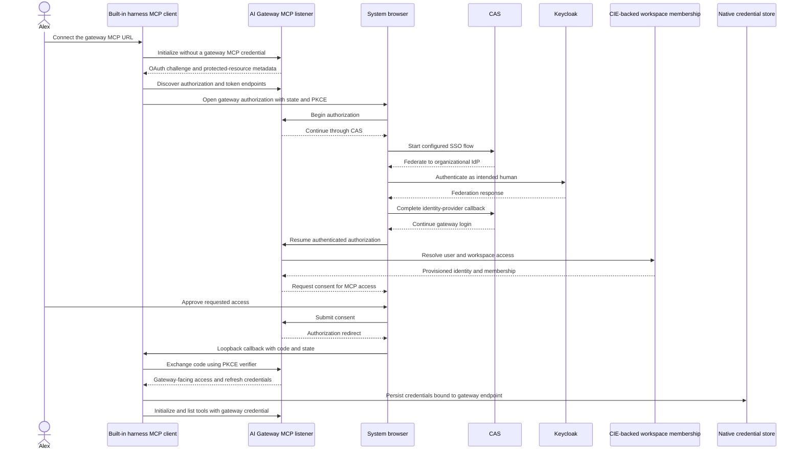
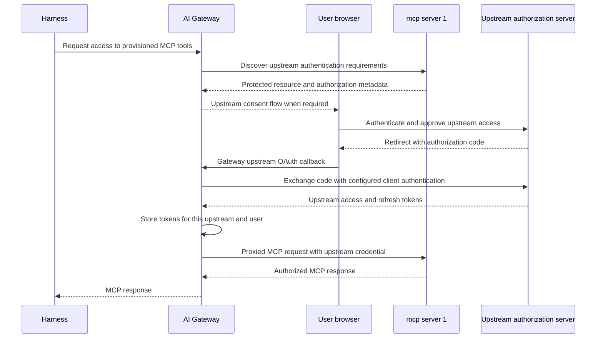

## SSO to ServiceNow: a complete first session

The outcome is concrete: you sign into the harness as yourself, connect the ServiceNow MCP integration in the same environment, and ask the agent to read an incident. Your company SSO identity is used throughout the human login steps. Inference and MCP still receive separate credentials, and the ServiceNow backend uses a server-side integration account.

**Release channel:** **airs-harness 0.1.0-alpha.22.mcp.3** is published and ready for local testing. The `mcp` tag selects this test release, including the in-session `/mcp` connection manager and `/doctor` dashboard. Fresh anonymous registry installations passed isolated acceptance on Linux x64, Linux ARM64 and Apple Silicon; real-account SSO, workspace-key inference and ServiceNow acceptance remain separate attended checks. The `latest`, `alpha` and `onboarding` tags remain **0.1.0-alpha.22.onboarding.4**, which does not include these dashboards. Install the exact version below and confirm `airs --version`; `airs-harness@mcp` selects the current test-channel version.

The npm package remains `airs-harness`; invoke it as `airs`. **Prisma AIRS CLI 7.0.0** and eight product skills are bundled as `airs cli`, so no separate product CLI installation is required. Supported native packages are Linux x64, Linux ARM64 and Apple Silicon; Windows and Intel Mac packages are outside this release.

Check Node.js and npm in the terminal you will use. The harness requires **22.13.0 or newer in the 22.x line, or 23.5.0 or newer** (`^22.13.0 || >=23.5.0`). Installing npm on Ubuntu does not upgrade a distro-provided Node 18. Install a supported Node version using your organization's method, reopen the terminal, and check again.

```sh
node --version
npm --version
npm install -g airs-harness@0.1.0-alpha.22.mcp.3 --registry=https://npm.example.com
airs --version
airs cli --version
```

Replace the example registry with your administrator's registry. Ordinary installs include the matching native package; `--include=optional` is unnecessary unless npm configuration explicitly omits optional dependencies. Upgrades preserve existing environments, credentials and histories. Restart an already running AIRS process after upgrading.

If an old standalone CLI owns `airs`, upgrade it to `@cdot65/prisma-airs-cli@7.0.1` first; it uses `airs-cli`. Do not force npm to overwrite another package's command. The standalone 7.0.1 release and the harness's pinned 7.0.0 bundle are intentionally distinct.

Use `type -a airs airs-cli airs-harness` and `airs --migration-check` to investigate a shadowed executable. A temporary `airs-harness` compatibility alias remains in alpha.22; new commands use `airs`. If an earlier review installation exported `PATH` or `AIRS_HARNESS_HOME`, use a fresh terminal so those exports do not select its isolated state.

### 1. Get the connection details and access

Ask your administrator for these public connection settings. The values below are examples, not a live tenant configuration.

| Setting | Example | Used for |
| --- | --- | --- |
| Inference API URL | `https://gateway.example.com/v1` | Model requests through AI Gateway |
| Company OIDC issuer | `https://sso.example.com/realms/company` | Your inference browser sign-in |
| Public native client ID | `harness-native` | The installed harness; no client secret |
| Inference audience | `airs-inference` | The resource expected in the inference token |
| ServiceNow gateway MCP URL | `https://gateway-mcp.example.com/mcp-service-now-dev/mcp` | Your gateway-mediated ServiceNow connection |

Your account needs inference access, membership in the gateway workspace that exposes ServiceNow, and a ServiceNow MCP subject binding with the appropriate incident permissions. Being able to sign into SSO does not grant those permissions automatically. The administrator provisions the gateway integration and its upstream OAuth client before you add it locally. The example integration targets a ServiceNow development instance.

Have Git, ripgrep and your project's own build tools available. Linux also requires a usable Bubblewrap sandbox. Use a desktop browser and an available OS credential store. On macOS, sign in from the desktop session and allow Keychain access. On Linux, make sure the Secret Service/keyring session is available and unlocked. Passwords belong in the company browser page, never in a command or configuration file.

### 2. Create or select a local environment

For a new profile, start guided creation:

```sh
airs env create work
```

Enter `https://gateway.example.com/v1`, choose **Create environment and sign in**, and follow one of the authentication paths below. This shell command finishes at the shell after sign-in, allowing the one-time MCP storage setting before opening your agent session. Cancelling before creation saves nothing; cancelling after creation preserves the environment so you can resume login.

If `work` already exists, reuse it:

```sh
airs env use work
airs --environment work login
```

Alternatively, supply the gateway URL explicitly, then sign in separately:

```sh
airs env create work --gateway-url https://gateway.example.com/v1
airs --environment work login
```

Creation with `--gateway-url` saves and selects the environment without opening sign-in. Bare `airs` also offers **Connect an environment** on a fresh installation. In the welcome screen, **Choose another environment** selects a destination for that session; `airs env use NAME` changes the saved default. Do not recreate an existing profile to repair a cancelled or denied login.

### Environments and gateway workspaces are independent

An **environment** is a local profile containing a gateway URL, credential binding, model settings, MCP connections and conversation history. Create one when you need separate credentials, destinations or histories—for example, `work-sso` and `workspace-api`.

Native MCP keyring records with the same connection name and URL can be shared by the same OS user across environments. Use distinct MCP connection names when you need separate local MCP credentials; a different environment name alone does not isolate that record.

A **gateway workspace** is the server-side boundary that owns provider access, saved model configs, API keys, budgets and guardrails. `airs env create` only creates the local profile. It does not create a gateway workspace or require matching names.

For example, local environments `work-sso` and `workspace-api` can both use the gateway workspace `agent-team`. An API key is bound to the workspace where it was created; SSO uses the authorized workspace mapping in its token. Renaming an environment does not change either binding.

```sh
airs env list
airs env use workspace-api
airs --environment work-sso doctor --verify-access
airs env remove workspace-api
```

`env use` changes the default for new commands; `--environment` selects one command's environment. `env remove` unregisters the local environment and preserves its history on disk. It does not delete a gateway workspace or revoke a key. Revoke keys in AI Gateway when their access should end.

### 3. Sign into inference with company SSO

Choose **Sign in with company SSO**. Enter the company issuer, public client ID and gateway audience from the table. These are public connection settings, not a client secret. Later attempts offer **Continue with saved settings**.

Choose **Open browser on this machine** on your desktop. Over SSH, choose **Use device authorization** and follow the displayed verification link and code on a device with a browser. **Show the full browser URL** retains the manual browser flow; its callback must reach the machine running AIRS, so device authorization is usually easier over SSH.

Sign in as the intended company user in the browser, then return to AIRS. The screen shows progress through authorization, native credential storage and a minimal inference access check. The browser success page alone does not prove credential persistence. **You're ready to use AIRS** means the credential was saved and that inference check passed. When the guided shell command completes, continue with the one-time MCP storage setting below. If you started with bare `airs`, you can return to the shell once to apply that prerequisite before starting your session.

The access check sends one small inference request and can consume gateway quota; it sends no local files or tools. A denied or unavailable gateway produces **Credential saved · gateway access needs attention**, with separate options to retry the check, continue or exit. Fix access before proceeding with this walkthrough. Storage failures remain sign-in failures and offer recovery guidance; inference credentials have no plaintext fallback. Escape cancels an unfinished sign-in and preserves the environment.

To supply public settings explicitly, use the existing command form:

```sh
airs --environment work login \
  --issuer-url https://sso.example.com/realms/company \
  --oidc-client-id harness-native \
  --audience airs-inference
```

If login was cancelled, run `airs --environment work login` and choose company SSO again. To inspect the saved environment or retry an access check without another browser login:

```sh
airs env status work
airs --environment work doctor --verify-access
```

`env status` inspects local configuration; it does not prove fresh authentication or remote access. `doctor --verify-access` sends another inference probe. Neither result tests ServiceNow tools. Adding MCP will not repair an incorrect inference URL or missing inference entitlement.

### Alternative: use a workspace API key for inference

Use this path when your administrator permits workspace-key authentication. You can use the same gateway workspace as SSO; the workspace policy must explicitly support both methods.

1. Open Prisma AIRS AI Gateway in Strata Cloud Manager and select the intended tenant and **gateway workspace**. The gateway is available under **AI Security → AI Gateway**; see the [vendor configuration guide](https://docs.paloaltonetworks.com/ai-runtime-security/administration/configure-ai-gateway).
2. In that workspace's API-key management, create a **user workspace API key** for your user. Give it inference permission (`completions.write`) and the expiration and limits required by your administrator. A provider integration key or AIRS scanner key is a different credential.
3. Attach the administrator-approved **default saved config** to the key. That config selects an authorized provider/model when the harness uses the gateway default. Confirm its provider is provisioned into this workspace. A key grants access; it does not create a model route.
4. Copy the newly issued key into the harness's hidden prompt. Do not put it in a command argument, shell history or chat transcript.

```sh
airs env create workspace-api --gateway-url https://gateway.example.com/v1
airs --environment workspace-api login --with-api-key
airs --environment workspace-api doctor --verify-access
```

Skip `env create` if the environment already exists. Interactive `airs login` also offers the workspace-key choice. The hidden prompt saves the key in the OS credential store. **Credential saved** confirms local storage; **Gateway access verified** confirms one successful inference request. A user key can retain gateway-side user attribution, but it does not create an OIDC sign-in session in the harness.

For recovery, HTTP 401 indicates rejected authentication; HTTP 403 indicates insufficient permission; HTTP 446 indicates a blocking guardrail. Some gateways return a completed response with HTTP 200 for a blocked request. AIRS checks the blocking hook results and reports that as a policy denial too. Give your administrator the trace ID, not the credential. Recreating a local environment will not fix a workspace policy or missing route.

**MCP still needs its own login.** Continue with the in-session ServiceNow steps below, using `workspace-api` wherever the example selects `work`. The gateway-facing MCP connection uses organizational SSO and its own authorization. Successful inference with a workspace key does not grant ServiceNow tool access or replace the gateway's upstream OAuth integration.

### Terminal controls and quiet operation

Use arrow keys or Tab to move, Enter to select, or the displayed number shortcuts. Escape cancels. Public fields accept pasted text without submitting it automatically; workspace API keys use a separate hidden prompt. Long authorization links and recovery messages scroll with arrow keys or Page Up/Page Down.

Set `animations = false` under `[tui]` in the environment configuration, or launch with `airs -c tui.animations=false`, for a static mark. `NO_COLOR=1` removes the accent colors. Small terminals use a compact layout. Plain terminals retain text prompts, and explicit scripted commands retain their existing output and exit behavior.

### 4. Require native MCP storage once, then open AIRS

Run `airs env show work` and locate its `state_directory`. In that directory's `config.toml`, set this **top-level** key before any `[table]` headers; update an existing value instead of adding a duplicate:

```toml
mcp_oauth_credentials_store = "keyring"
```

This explicitly requires the OS credential store for MCP tokens. The current connection manager respects the configured mode but does not enforce this setting automatically. Do this before MCP sign-in; do not select a file fallback to work around an unavailable credential service. Linux needs an available Secret Service session, and macOS may request Keychain authorization.

```sh
airs --environment work
```

The remaining connection workflow stays inside AIRS. It uses the environment displayed by this session, even if another terminal changes the saved default.

### 5. Add ServiceNow and complete MCP SSO inside AIRS

1. Enter `/mcp` to open **MCP connections**.
2. Choose **Add gateway MCP server**. Enter the local connection name `service-now` and `https://gateway-mcp.example.com/mcp-service-now-dev/mcp` as the gateway URL.
3. Complete **Sign in to gateway MCP**. Use **Ctrl+O** to open the browser on this machine or **Ctrl+Y** to copy the authorization URL. Over SSH, open that URL on your browser host and paste the complete callback URL into the terminal's hidden callback input when requested. Never paste it into the agent conversation or a support report.
4. In the gateway's company SSO flow, choose the **same company account** used for inference. With workspace-key inference, choose the organizational account that has the MCP workspace grant. An existing browser session may avoid another password prompt; account selection or consent can still appear.
5. Complete any gateway-managed upstream consent. Wait for native credential persistence and MCP initialization/tool discovery to finish. After **MCP connection updated**, choose **Start new conversation**.

The process stays open; your previous conversation remains saved and your unsent draft carries over for review. Nothing is submitted or replayed automatically. This transition is required because a changed MCP identity or tool inventory cannot safely be inserted into the old conversation. An opaque gateway MCP token does not prove continuity with the inference identity.

If a connection was saved but sign-in was cancelled or failed, select `service-now` in `/mcp` and choose **Sign in**. Do not add a duplicate. Use **Reconnect and verify** for a fresh connection check; **Refresh connections** refreshes the manager's view. A cached inventory alone is not proof of current tool access.

The URL must be the gateway's integration URL, including `/mcp`, never the direct ServiceNow instance or upstream MCP server. The harness signs into the gateway; the gateway owns upstream OAuth and its confidential client; the MCP service holds the ServiceNow integration credential. Do not copy inference tokens or ServiceNow passwords into MCP configuration.

Shell commands remain available as an optional fallback:

```sh
airs --environment work mcp add service-now \
  --url https://gateway-mcp.example.com/mcp-service-now-dev/mcp \
  --scopes mcp:servers:read,mcp:tools:list,mcp:tools:call
# Only if the add flow did not finish sign-in:
airs --environment work mcp login service-now --no-browser
```

### 6. Inspect health and verify a read-only ServiceNow call

Enter `/doctor` for the current environment's connection-health dashboard. Opening it or choosing **Refresh diagnostics** does not send an inference request. **Verify gateway access** opens a confirmation; **Send connectivity check** sends a small inference request that can consume quota and appear in gateway logs. It sends no local files, conversation content or tools. This verifies inference, not ServiceNow permissions.

Return to `/mcp`, select `service-now`, and use **Reconnect and verify** if you need fresh initialization/tool discovery. Choose **Start new conversation** after connection changes, then inspect the available tools. A read-only grant exposes `list_incidents` and `get_incident`; incident-management grants may also expose `create_incident` and `update_incident`. Successful login does not imply all four permissions.

Ask in the new conversation:

> Use the service-now MCP connection to list up to five active incidents. Show their numbers, short descriptions and priorities. Do not create or update any records.

Confirm that the transcript actually called `list_incidents` on `service-now` and returned a tool result. An empty authorized list is valid. A connected label, an inventory, or a model answer without a tool call is not end-to-end evidence. This final live check is for your provisioned account; it was not performed by the documentation update.

### 7. Use the bundled Prisma AIRS product CLI and skills

The ServiceNow session above needs no product management credential. If you also manage Prisma AIRS products, configure a separate CLI tenant using credentials supplied for that tenant:

```sh
airs cli tenant create development
airs cli tenant switch development
airs cli --tenant development doctor
airs cli runtime --help
```

`tenant create` prompts for the tenant service group ID, OAuth client ID and a hidden client secret, and saves a private JSON configuration. It does not select the tenant until `tenant switch`. To register an existing JSON file without copying or changing it, use `airs cli tenant create development --config /secure/development.json` instead. Doctor reports which capabilities the configuration supports; it can perform remote probes and is not a guarantee that every product is licensed or authorized.

Harness environments and CLI tenants are independent. `airs env use work` selects the conversation, inference login and MCP connections. `airs cli tenant switch development` selects product credentials. Prefer `airs cli --tenant development ...` in scripts. Put `cli` immediately after `airs`; `airs --environment work cli ...` does not select a product tenant. Company SSO does not supply Prisma AIRS management API credentials, and the CLI does not read old dotenv credentials as a fallback.

In the harness, ask:

> Use the bundled prisma-airs-cli skill to inspect the development tenant's configuration and identify available read-only Prisma AIRS commands. Do not create, change or delete resources.

The skills invoke the private bundled executable, so a global CLI version cannot silently replace it. They cover runtime scanning, AI Gateway, red teaming, model security and related workflows. Check the proposed tenant and operation before authorizing writes. Standalone `airs-cli` and `airs cli` use the same tenant store, so switching the saved CLI tenant affects both entry points.

### Return, switch and recover

List environments with `airs env list`; switch the saved default with `airs env use work`. A bare `airs` then opens that environment. `--environment NAME` selects an environment for one command without changing the saved default. Each environment has its own history, inference identity binding and MCP configuration.

| Symptom | Next step |
| --- | --- |
| Inference login was cancelled | `airs --environment work login`; reuse the environment |
| Gateway MCP login needs renewal | `/mcp` → `service-now` → **Sign in**, then **Start new conversation** |
| Inference succeeds but ServiceNow is absent | `/mcp` in the selected environment, then the gateway URL and workspace integration grant |
| Browser callback says success but the terminal fails | `/doctor`; check native credential-store persistence and keep the terminal open through completion |
| Workspace key needs replacement | Leave the session, run `airs --environment work login --with-api-key`, then reopen the same environment |
| Credential cleanup is pending | Restore credential-service access, then retry the displayed environment-specific login or logout; unavailable does not necessarily mean locked |
| Gateway returns 404 | Check the exact ServiceNow gateway URL and its final `/mcp` |
| Tools return an authorization error | Have an administrator check the gateway workspace grant and upstream incident roles/scopes/subject binding |

For inference SSO renewal, `/doctor` offers **Restore company sign-in**, or use `/signin`. Workspace-key replacement remains a shell operation. Neither operation grants MCP permissions. Escape cancels an unfinished action; existing work remains saved.

To retire the environment, use `/mcp` → **Sign out** if desired, then sign out the credentials you intend to remove while it is still selected and unregister it:

```sh
airs --environment work mcp logout service-now
airs --environment work logout
airs env remove work
```

`env remove` preserves local files and history and does not itself revoke credentials. If it was the default, select another environment before starting a new session. Recreating the same name creates a fresh namespace, not a reconnection to the preserved history.

The steps above define what to verify. They do not claim that this documentation edit performed a fresh human SSO login or a live ServiceNow tool call. See [Implementation status and public sources](./evidence.md) for the recorded deployment and release limits.

## Authenticate for the gateway destination

From Alex's chair, signing in looks like one event: a browser opens, Keycloak asks for a password once, and afterwards both the model and mcp server 1 respond. Underneath, there are separate grants, and this lesson is about seeing them separately, because when one of them expires or is denied, the other keeps working and the symptom only makes sense if you know which grant failed.

Both inference and MCP must target Prisma AIRS AI Gateway. The sequences below separate the native gateway login, which the harness performs, from the gateway-owned upstream login, which the gateway performs on Alex's behalf. An existing Keycloak browser session can make both feel like one sign-in. It does not make them one grant.

The inference leg is the simpler one, and it is already in place in the case study. A user signs in to Keycloak using the configured native-client flow and presents a gateway-authorized JWT. A workspace API key is a separate supported authentication mode for inference; it does not require converting the key into a Keycloak token. Nothing in the MCP work below changes the inference leg, so a working inference environment stays as it is while MCP is brought onto the gateway path.

## Native MCP login through the gateway

The native MCP login is the longer sequence because three parties take part in authenticating Alex: the gateway that will issue the credential, CAS that runs the organizational sign-in, and Keycloak that actually verifies the person. Read it top to bottom and notice that the client only ever talks to the gateway and the browser.



The sequence starts with a failure on purpose. The client initializes without a credential, the gateway answers with an OAuth challenge and protected-resource metadata, and that metadata is how the client learns where to authorize and where to exchange the code. The browser then carries Alex through CAS to Keycloak and back. After the gateway has a verified identity, it resolves workspace membership from the CIE-backed directory, asks for consent, and only then redirects to the loopback callback with a code. The PKCE exchange turns that code into gateway-facing credentials, which the client stores bound to the gateway endpoint before using them to list tools.

CAS is the gateway-facing user-authentication method in SCM deployments. The diagram shows the shape of the flow; the actual callback, client registration, token issuer, audience and scopes must be verified from the gateway's discovery and deployed configuration rather than assumed from the picture. One inference to resist: Keycloak appeared during federation, but that does not establish that the resulting MCP token is the same JWT used for inference. It was issued by the gateway for the gateway. [OAuth in SCM](https://portkey.ai/docs/product/mcp-gateway/authentication/cas).

If an operator selects the gateway's External OAuth mode instead, the browser hop changes: the harness presents a Keycloak-issued token using the configured gateway authentication contract. The destination does not change. It still targets the gateway, and switching to a direct upstream URL is never the fallback for a failed gateway login, because the upstream would not accept the client's credential anyway.

## Upstream OAuth remains with the gateway

The first sequence got Alex to the gateway. It did not get anything to mcp server 1, which has its own authorization server and its own idea of who Alex is. That second leg belongs to the gateway.



Compare the two callbacks. In the first sequence the code came back to the harness on loopback. Here it comes back to the gateway, the gateway exchanges it using its own configured client authentication, and the resulting upstream access and refresh tokens are stored at the gateway for this upstream and this user. The harness never holds them; it holds only its gateway-facing credentials.

The exact consent trigger and order depend on the registered upstream integration, so expect variation between integrations. Gateway OAuth Auto and machine client credentials are distinct modes. A failure in the machine mode does not demonstrate that OAuth Auto is unavailable. The gateway manages upstream OAuth, and the harness must not acquire upstream tokens to bypass that step, since doing so would move a credential the architecture keeps server-side onto the workstation. [MCP authentication layers](https://portkey.ai/docs/product/mcp-gateway/authentication).

The earlier diagrams use mcp server 1, the utility example in this course. The ServiceNow walkthrough above uses the same gateway login boundaries with a different upstream service and a separate backend credential.

Continue with [End-to-end question walkthrough](./walkthrough.md) and [Implementation status and public sources](./evidence.md).
