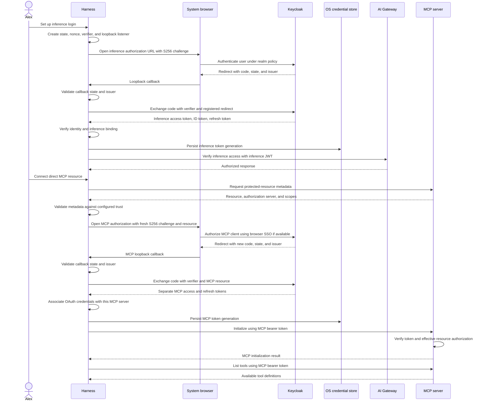
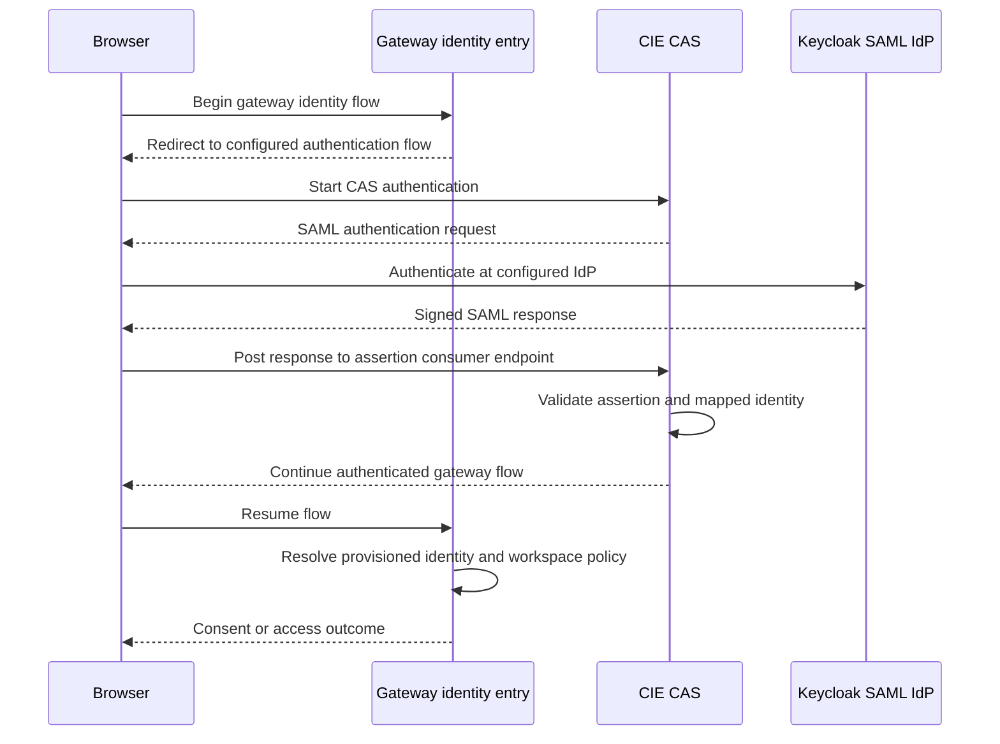

## Begin with a configured trust relationship

The harness starts with an expected issuer, a registered native client, and a resource. Discovery confirms the server's advertised contract against those settings. It is not permission to send tokens to any URL returned by an arbitrary server.

The reviewed MCP server publishes protected-resource metadata at `/.well-known/oauth-protected-resource/mcp`. An unauthenticated MCP request receives a 401 challenge advertising metadata. The client checks the resource, authorization server, and requested scopes before beginning login. See [RFC 9728](https://www.rfc-editor.org/info/rfc9728/) for metadata and the [MCP authorization specification](https://modelcontextprotocol.io/specification/2025-11-25/basic/authorization) for its use in MCP.

## End-to-end native login

This sequence shows both native logins. The operator signs in as the same human for both resources. The built-in Codex MCP client maintains a distinct OAuth client registration and token bundle; it does not compare an MCP ID token with the inference identity. Browser redirects carry a short-lived code; tokens are obtained through a separate token-endpoint exchange.

The browser may reuse its Keycloak session during the second authorization. That improves usability without reusing the inference access token. Each OAuth authorization attempt has a fresh verifier and state. Inference additionally uses OIDC identity verification. The MCP login requests only `airs.gateway.read` and `airs.profiles.read`; it does not request `openid` or depend on an ID token.

PKCE binds code redemption to the client that created the verifier. The challenge is derived from the verifier; the verifier is sent only during the token exchange. `state` correlates the callback, while OIDC `nonce` participates in ID-token validation. The mechanisms address different parts of the flow. [PKCE specification](https://www.rfc-editor.org/info/rfc7636/).

The MCP client includes its `resource` indicator during authorization, exchange, and refresh. This helps keep credentials bound to the intended endpoint. The resource server must still enforce the audience. [Resource indicators](https://www.rfc-editor.org/info/rfc8707/).

## When CIE/CAS participates in browser login

The next sequence is the related gateway identity pattern, not an extra mandatory step in the native sequence above. The SCIM population must already exist. Exact gateway OAuth behavior needs its own deployment evidence.

CAS is the SAML service provider in that exchange; Keycloak is the SAML IdP. The assertion is delivered through the browser. It is not the direct MCP bearer token. Compare the two sequences before assuming that “SSO” names one protocol or one audience.

## User-visible failures

A canceled browser login returns the user to setup. A callback with mismatched state must fail. Inference protects its existing identity binding. MCP independently authorizes the subject in the access token at the server; sign in as the intended account in the second browser flow. Set `mcp_oauth_credentials_store = "keyring"` to require the native credential store and prevent the built-in auto mode from falling back to a file. `--no-browser` changes how the authorization URL is presented, not the authentication requirement.

Continue with [Refresh revocation and identity changes](./lifecycle.md). Deployment-specific evidence is in [Implementation status and public sources](./evidence.md).
