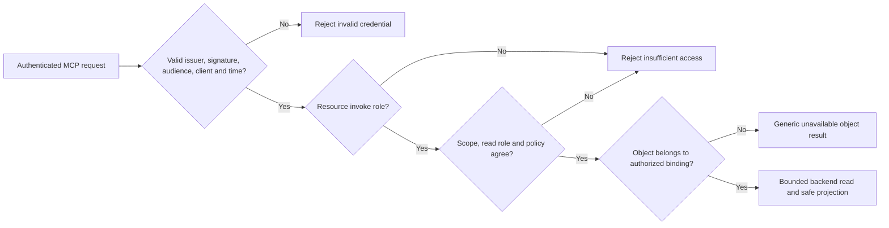
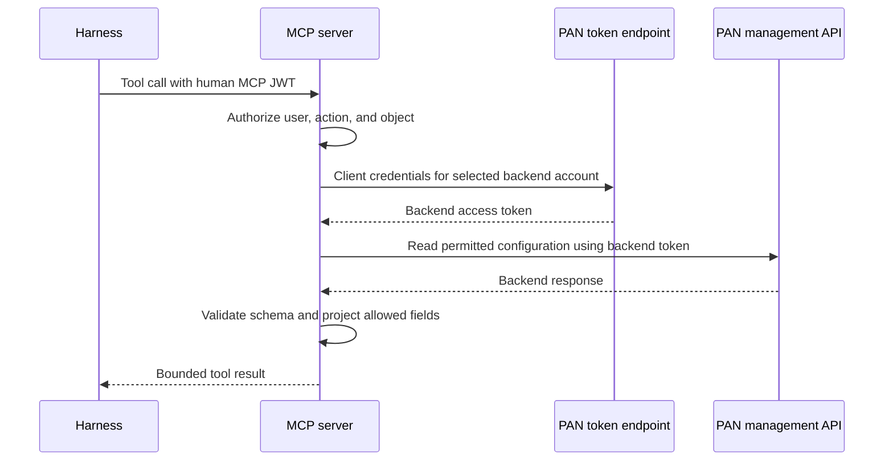

## Give the assistant a small, enforceable tool surface

The initial `prisma-airs-mcp` server exposes eight configuration-read tools. It returns projected summaries rather than raw upstream JSON. This lets Alex ask useful questions without receiving server credentials, full authentication configuration, prompts, or logs.

| Scope | Tool | Purpose |
| --- | --- | --- |
| `airs.gateway.read` | `list_workspaces` | Enumerate permitted workspaces |
| `airs.gateway.read` | `get_workspace` | Read one permitted workspace |
| `airs.gateway.read` | `list_gateway_configs` | List configurations in a permitted workspace |
| `airs.gateway.read` | `get_gateway_config` | Read a configuration with its workspace ID |
| `airs.gateway.read` | `list_gateway_guardrails` | List guardrails in a permitted workspace |
| `airs.gateway.read` | `get_gateway_guardrail` | Read a guardrail with its workspace ID |
| `airs.profiles.read` | `list_security_profiles` | List explicitly permitted profiles |
| `airs.profiles.read` | `get_security_profile` | Read one permitted profile |

## Authorization is an intersection

A request must pass token validation and have this resource's `invoke` role. Its effective read permission is the intersection of the issued scope, the corresponding resource role, and the server policy's permitted scopes. Access to the requested object must also be inside the subject's explicit workspace/profile binding.

Suppose Alex has `airs.gateway.read` and `gateway.read`, but the policy permits only `workspace-learning`. A request for `workspace-finance` still fails. A second user with the same roles gets only that second user's own policy bindings. A list or cursor from one identity must not become a shortcut into another identity's inventory.

For inaccessible object details, the server avoids distinguishing a foreign object from a nonexistent object. Detail reads require ownership context such as `workspace_id`; possession of an object ID is insufficient authorization.

## The backend identity changes at the server

The backend token may be cached; the sequence shows acquisition when needed. The human JWT is not forwarded to PAN management APIs. Separate service accounts support gateway reads and runtime-profile reads in each environment. Gateway IAM permissions are workspace scoped. Runtime profile inventory is tenant scoped upstream, so explicit server-side profile filtering remains necessary.

This creates two permission checks: PAN IAM limits the server account, while MCP policy limits each human. If the human loses access, the existence of a functioning backend credential does not authorize the human's request.

## Read-only also needs bounds

The reviewed implementation defaults lists to 20 objects and caps them at 50. Signed cursors bind identity, client, effective grants, permitted resources, query, and inventory snapshot; they expire after five minutes. Tool calls have a 20-second budget, backend reads a 10-second deadline, and response/body limits prevent unbounded data retrieval.

Authentication is checked per request. The service uses stateless Streamable HTTP rather than treating an earlier MCP initialization as a durable login. Rate limits are per user/client and per replica in this implementation; two production replicas do not create one globally coordinated quota.

**Checkpoint:** why keep app-level profile filtering if the backend account is read-only? Read-only controls operations, but it does not constrain which tenant profiles the upstream inventory returns.

Protocol background: [MCP authorization](https://modelcontextprotocol.io/specification/2025-11-25/basic/authorization). Exact tool and policy behavior: [Implementation status and public sources](./evidence.md).
