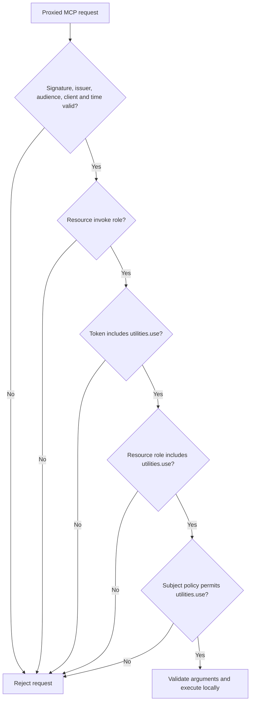
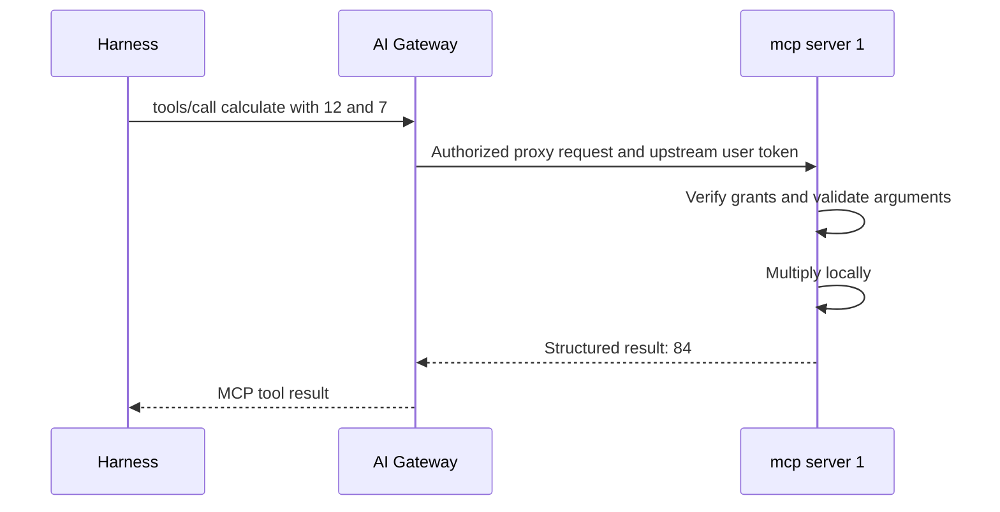

## Eight tools, executed on mcp server 1

When Alex asks for 12 times 7 and the server's time, the work is done by mcp server 1, a separately deployed service that exposes utility operations through MCP. The gateway proxies the calls, and the server performs the work using its own process, its own clock and its operating-system random source. Nothing is fetched from a management API behind these tools; that is what the course means when it calls the execution local. If you are used to tools that wrap another API, notice that this server has no downstream call to make, which is why the interesting part of this lesson is not what the tools do but what has to be true before the server will do it.

| Tool | Inputs and behavior | Example |
| --- | --- | --- |
| `calculate` | Two finite numbers and add, subtract, multiply, divide, modulo or power | `{"operation":"multiply","a":12,"b":7}` returns `84` |
| `format_json` | JSON text and indentation from 0 to 4; 0 produces compact output | `{"text":"{\"ready\":true}","indent":2}` |
| `transform_text` | Text plus uppercase, lowercase, trim or Unicode NFC normalization | Uppercase `hello` to `HELLO` |
| `encode_base64` | UTF-8 text to standard padded Base64 | `hello` becomes `aGVsbG8=` |
| `decode_base64` | Canonical padded Base64 to valid UTF-8 text | `aGVsbG8=` becomes `hello` |
| `hash_text` | UTF-8 text with SHA-256 or SHA-512; SHA-256 is the default | Return the selected algorithm and hexadecimal digest |
| `generate_uuid` | Generate 1 to 100 random version 4 UUIDs | `{"count":2}` |
| `current_time` | No arguments; read the MCP server's UTC clock | ISO 8601 text and Unix milliseconds |

The tools have ordinary implementation limits, and they matter for reading results correctly. Arithmetic uses JavaScript number precision. Invalid JSON, division by zero, non-finite results and invalid Base64 or UTF-8 return tool errors rather than partial output. Inputs and outputs are bounded. Time and UUID generation can return different results on repeated calls, so two identical requests are not expected to produce identical results.

One discovery detail trips people up. The server currently provides tools without MCP resources or resource templates, so a client that lists resources sees an empty list. That does not mean the tools are unavailable: tool discovery and resource discovery are separate MCP capabilities, and each answers only its own question. See the [MCP tools specification](https://modelcontextprotocol.io/specification/2025-11-25/server/tools).

## A local calculation still needs authorization

A multiplication looks too trivial to guard, but the server does not decide based on how simple the operation is. It decides based on who is asking and what they were granted. Two receivers ask that question in sequence. The gateway checks whether the user can reach the integration at all. mcp server 1 then verifies the gateway-held upstream JWT and its own grants, independently of what the gateway decided.

All eight tools use the `utilities.use` scope, so the grant is the same whichever tool the model selects. Effective access is the intersection of three things: the scope that was actually issued in the token, the `utilities.use` role on this specific resource client, and the subject's policy binding on the server. `invoke` is required as well. Each of these can be present without the others, which is why the server checks all of them. Requesting a scope during login does not grant it; only the issued token shows what was granted. Roles that belong to another resource client do not count, even if they carry the same name.

The subject policy is narrower than it might sound. It grants utility use, and that is all it enumerates. It says nothing about permitted workspaces, configurations or security profiles, because none of those objects are inputs to these tools and the server would have no use for the information.

## What crosses the boundary

Local execution describes where the computation happens. It does not describe where the data goes, and the sequence for a single call shows the difference.

The arguments travel from the workstation through the gateway to the MCP server, and the result comes back the same way. So "local" does not mean the input stays on the workstation. It also does not mean the result stops at the harness: the result may be included in a later inference request, which sends it through the gateway again.

The server's tool annotations describe a read-only, non-destructive surface with no open-world tool execution. Treat those annotations as descriptive hints for clients and models. The behavior you can rely on comes from the actual implementation and the authorization checks above, not from the annotation. And the read-only label applies to these tools only; the harness's separate shell and file tools retain their own permissions.

**Checkpoint:** Alex has an inference token and wants to call `calculate`. Can the server accept that token because the operation is simple? No. The first decision in the diagram is about the token's audience, and an inference token was issued for a different resource. The operation's simplicity never enters the decision. The server still requires the upstream MCP token and the utility grants.

Continue with the [complete question walkthrough](./walkthrough.md).
