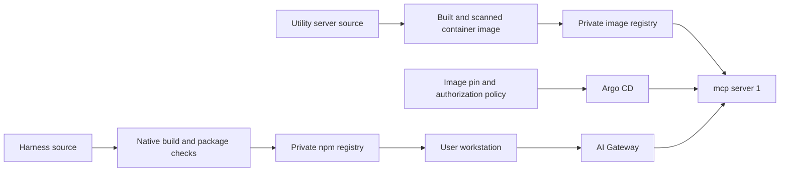
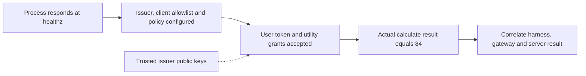

## Deliver the client, gateway and server separately

One request from Alex crosses three separately delivered systems. The harness is distributed as a native npm package for Linux x64 and Apple Silicon. AI Gateway and mcp server 1 are separate deployments with their own pipelines. The user experiences one answer, but the release boundaries stay separate even when a single request crosses all three. Treating them as one is how a passing check on one component gets mistaken for acceptance of the whole path.

The diagram also shows which secrets live where. mcp server 1 does not need a management-API service account for its utility functions, because the tools compute locally. The deployment still needs its issuer, resource audience, allowed gateway client and subject policy, since authorization does not disappear just because the work is local. Registry delivery credentials and the gateway's upstream OAuth client secret serve different purposes and stay with their respective components.

## Separate health from successful use

"The process is up" and "the feature works" are different statements. In this system there are four such statements stacked on top of each other, and each one is a separate observation.

`healthz` proves the process responds. `readyz` reports whether the required client allowlist and subject bindings are configured; it is not a live OAuth or tool test, so a ready server can still deny every real user. A successful native login proves the OAuth leg but not the tool path, so it must be followed by tool discovery and a completed tool call before you can say the utility path works.

Useful telemetry includes authorization-rejection categories, tool name, outcome, duration, request ID and serving image revision, because together they tell you which observation failed and on which build. Keep arguments, credentials and private conversation content out of public incident records.

## Validate a release at the right boundary

The same logic applies to release validation. Each check below establishes one thing, and none of them establishes the row beneath it.

| Check | What it establishes |
| --- | --- |
| Source tests | The exercised behavior of the reviewed implementation |
| Native executable checks | Behavior on the selected build and platform |
| Signature and notarization | Apple Silicon signing identity and notarization verification |
| Fresh registry installation | Published archive integrity and the executable users receive |
| In-place upgrade | Configuration, history and command resolution survive the upgrade |
| Gateway utility call | The current authenticated proxy path completed an actual operation |
| Active and idle lifecycle exercises | Renewal and recovery across the tested time boundaries |

An older successful call against another inventory does not establish current utility acceptance, because the check was made against a different server. And a package can be published for maintainer testing while timed production acceptance remains incomplete; publication and acceptance are separate rows, and [Implementation status](./evidence.md) records that distinction.

## Recovery and rollout

Pin server images and reconcile every serving replica, because a policy change that reaches only some replicas produces denials on some requests and not others, which looks like a client bug. When changing utility authorization, verify both an allowed subject and a denied subject; a test that only proves access does not prove the denial you intended. For connection failures, check the gateway integration and OAuth leg before changing server permissions, since the request may never have reached the server.

On the workstation, native credentials belong in macOS Keychain or Linux Secret Service. An npm installation does not create an unlocked desktop credential store, so an install can succeed and still be unable to save a login. An upgrade can also leave an old manual executable earlier on `PATH`; verify the resolved command and `airs-harness --version` before concluding that an upgrade did not take.

The educational site is delivered from a separate repository. Its explanations and diagrams should be reviewed alongside the implementation evidence whenever an interface or trust boundary changes.
