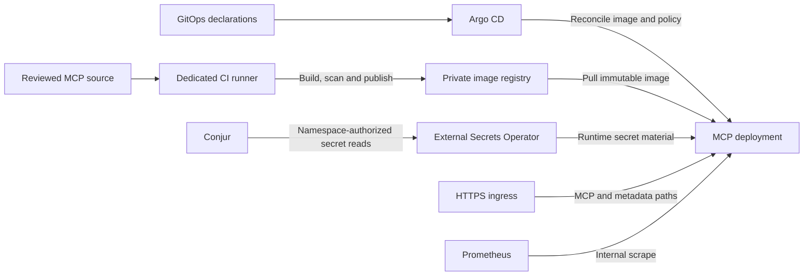
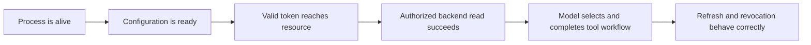

> **Architecture correction — September 14, 2026:** The required harness sends both inference and remote MCP traffic through Prisma AIRS AI Gateway. Earlier direct-MCP flows and their acceptance records describe a divergent implementation. They do not validate the required gateway/CAS path. Read [System architecture](./architecture.md) for the corrected contract.

## Deliver a service without mixing identities

The MCP deployment separates the identity that builds an image, the identity that retrieves runtime secrets, the service accounts that call PAN APIs, and the human identity making an MCP request. Each exists for a different boundary.

This diagram describes the recorded deployment pattern. The educational GitHub Pages site is a separate static publication with no connection to these runtime secrets. A reader should be able to explore the curriculum without authenticating to the lab infrastructure.

## Three kinds of configuration

| Kind | Example | Delivery |
| --- | --- | --- |
| Public trust/configuration | Issuer URL, resource URL, allowed client IDs | Deployment configuration |
| Authorization policy | Subject-to-workspace/profile bindings | Versioned policy with rollout |
| Secret | Backend client secret or cursor signing key | Secret manager and namespace-specific retrieval |

The reviewed service loads its policy at startup. A policy update must reach all replicas before the change is effective everywhere. Hashed policy ConfigMaps help trigger a workload rollout. A Git commit is desired state; the running replicas and a negative authorization probe establish applied state.

Development has one replica and production two in the recorded acceptance. The server uses a nonroot process, a read-only filesystem, network restrictions, and no mounted Kubernetes API token. Public ingress exposes MCP and metadata paths; health, readiness, and metrics remain internal.

## Health is layered evidence

Each step answers a stronger question. A green readiness probe does not establish backend authorization. A successful direct `tools/call` does not establish that the model sees the tool schema. Successful metrics scraping does not establish alert notification delivery.

Historical service acceptance includes all eight tools, authorization negatives, native Linux and Apple Silicon candidate login/tool cycles, rotating refresh concurrency, a 30-minute production soak, namespace secret isolation, and a development recovery exercise. The candidate used the superseded helper path; its client results cannot establish the built-in client's lifecycle behavior. It does not establish Windows direct MCP acceptance, public Internet reachability, or alert receiver delivery.

## Deliver the client integration separately

The built-in MCP client ships in the normal `airs-harness` npm distribution for Linux x64 and Apple Silicon. The remote MCP server continues to use its own image and GitOps rollout. Updating the client does not embed or redeploy that service.

The reviewed alpha.13 release work requires native OAuth/tool workflows, two real expiry intervals with concurrent fresh processes, npm installation and in-place upgrade checks, and matching native executable hashes. Mac signing and notarization are separate evidence. An old manual command symlink can shadow an npm upgrade, so acceptance must resolve the executable that actually runs. See [Implementation status and public sources](./evidence.md) for outstanding release gates.

## Recovery should restore an understood state

Pin images by accepted digest. For a bad rollout, restore the known accepted digest and verify serving replicas before checking the user path. For missing runtime secrets, inspect the ExternalSecret's source identity and reconciliation result without printing the secret. For an authorization regression, compare the active policy version and token generation.

The recorded development recovery intentionally broke an image pull, restored the accepted image, and verified recreation of a deleted development secret. That does not mean every disaster-recovery scenario or backup restoration was exercised.

The optional integration lab in [Labs and answer keys](./labs.md) collects sanitized outcome evidence. See [Implementation status and public sources](./evidence.md) for the public evidence summary; detailed operational receipts remain outside this publication.
