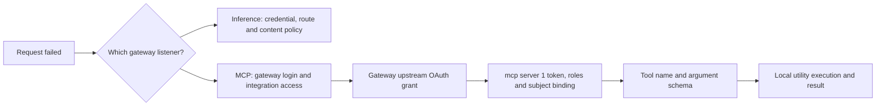

## Locate the failing step

Something failed. Before changing anything, decide which boundary it failed at. Follow the request from the harness to the intended gateway listener, then to the model or mcp server 1, and ask at each hop whether the problem is authentication (who are you), authorization (what may you do), argument validation (is the input acceptable) or tool execution (did the work succeed). Those are four different questions, and the fixes for them do not overlap: a new login does not repair a bad argument, and a corrected argument does not add a missing grant.



## Diagnose inside the selected environment

In the mcp test channel, enter `/doctor` for the connection-health dashboard. **Refresh diagnostics** refreshes local diagnostics without making an inference request. A native-store availability check does not prove that every saved credential is readable. **Verify gateway access** asks for confirmation; only **Send connectivity check** sends the small inference probe. It may consume quota and appear in gateway logs, but sends no local files, conversation or tools. The equivalent shell commands are `airs --environment work doctor` and `airs --environment work doctor --verify-access`.

**Restore company sign-in** renews inference SSO for the same verified identity. Workspace-key replacement remains a shell action: leave the session, run `airs --environment work login --with-api-key`, and reopen the same environment. Use the name displayed by the session; local names do not need to match gateway workspace names.

For MCP, select the affected connection through `/doctor` or `/mcp`. Choose **Sign in** for expired or absent credentials, or **Reconnect and verify** for fresh initialization and tool discovery. After connection changes choose **Start new conversation**; history and the unsent draft remain saved and nothing is replayed. A tool inventory is still weaker evidence than a completed authorized tool call.

A workspace key being saved is not evidence of an allowed model route. Check the key's workspace, inference permission and default saved config with your administrator. Recreating a local environment does not fix a gateway route or policy denial. An unavailable native credential service does not necessarily mean a locked store: check its availability and any OS authorization prompt in the same user session. If cleanup is pending, restore service access and retry the displayed environment-specific login or logout; retain both the original and cleanup error categories in a sanitized report.

## Symptoms and useful checks

Most of the checks below test a boundary rather than a component, so the first question is usually whether the request reached the place you think it reached.

| Symptom | First useful check |
| --- | --- |
| Inference fails after about 30 minutes idle | Whether the inference grant is still renewable; use the company sign-in prompt |
| Alpha.15 shows the generic bound-credential fatal error after idle | Enter `/signin`; alpha.16 includes the provider-routing correction for automatic guidance |
| Login completes but credential save fails | Native Keychain or Secret Service availability and the reported storage category |
| Browser cannot reach localhost | Use the current MCP flow's hidden callback input over SSH, or verify callback routing for browser-only inference flows |
| Gateway denies workspace access after CAS login | CIE group-to-workspace mapping and the workspace Members view |
| Gateway MCP login succeeds but upstream needs consent | The separate gateway-held upstream OAuth grant |
| mcp server 1 rejects the token | Issuer, signature, resource audience, allowed client and time limits |
| mcp server 1 rejects authorization | `invoke`, `utilities.use` scope and role, and the subject's policy binding |
| Resources list is empty | Inspect `/mcp` for tools; resources and tools are separate capabilities |
| The model never selects a visible tool | Actual inference tool declarations and model-returned function calls |
| `calculate` fails for division by zero | Correct the input; a new login does not repair arithmetic |
| `decode_base64` rejects text | Canonical padding and valid decoded UTF-8 |
| `current_time` differs from the workstation | The tool reports the MCP server's clock |
| An upgrade still shows an older version | Resolved executable, npm prefix and `PATH` ordering |

Tool execution has no downstream management API to diagnose, which removes a whole class of failure from the utility path. The server's authentication layer can still depend on trusted signing-key retrieval, so DNS or issuer-key failures are real, but they belong to the identity boundary rather than to the tool.

## The alpha.15 idle-return incident

The maintainer returned after about 30 minutes idle and received a generic fatal credential-helper error. Manual `/signin` completed, preserved the same verified identity and conversation, and allowed the next inference reply. The credential path was fine; what failed was the guidance. The normal AIRS provider dispatch had bypassed the typed recovery handler, so the terminal never received the classification it uses to show sign-in guidance. Alpha.16 corrects that route so an expired or otherwise non-renewable sign-in reaches the terminal's guidance. A real helper integration test failed before the change and passes afterward; all 78 provider tests pass. Be precise about what that evidence covers: it establishes the source correction. It does not prove every production token-renewal case.

## Ubuntu SSH credential readiness

An SSH connection and a usable credential store are separate prerequisites. Public-key SSH authentication does not automatically unlock an encrypted login keyring. Check readiness in the same OS user session that will run AIRS:

1. Confirm a supported Node version and npm. The harness requires Node 22.13.0 or newer in the 22.x line, or 23.5.0 or newer; installing npm does not upgrade Node 18.
2. Confirm Bubblewrap is installed and the host permits the harness's sandbox. Have the administrator diagnose the applicable namespace or AppArmor policy if the sandbox cannot start; do not disable those protections globally.
3. Confirm a per-user D-Bus session and a Secret Service provider are available. A running provider and an unlocked encrypted collection are separate conditions.
4. Unlock the existing collection through the OS credential service in that user session, and handle any OS authorization prompt. A missing service, a locked collection and a denied authorization need different repairs.

```sh
node --version
npm --version
command -v bwrap
command airs --version
airs --environment work doctor
```

The version and prerequisite checks need no production credential. Run `doctor` after selecting an existing environment; it reports local readiness without an inference request. `doctor --verify-access` is a separate authenticated probe that can consume gateway quota. A readiness report does not prove every saved credential is readable or that a model route is authorized.

New environments created by mcp.4 and later require native MCP storage and fail sign-in without a plaintext fallback when the service is unavailable. Older environments keep their existing mode; use the login lesson's cleanup-and-sign-in procedure if migrating them. Preserve the existing keyring and credentials while repairing access: do not reset the store, copy token files or choose plaintext storage as a workaround. Enter an unlock password only through a trusted hidden prompt or the credential service's protected input, never in command arguments, logs or chat.

The Ubuntu helper bundled in mcp.4 predates a keyring-daemon correction. Use the verified mcp.5 helper or a corrected administrator-provided copy rather than extracting that older helper for SSH unlock. The corrected helper checks the actual collection state, preserves encrypted data after a wrong password, and reuses an unlocked service. The bundled mcp.5 helper passed its isolated encrypted-keyring regression with the default mcp.5 version. That package proof is separate from the user's own successful unlock; the implementation-status lesson records both boundaries.

The isolated fresh-Ubuntu checks establish fixture readiness. A subsequent read-only observation found an unlocked user collection and passing readiness reports; that observation does not imply the checks unlocked it or establish company SSO.

## Browser callbacks on a remote machine

A callback to `127.0.0.1` reaches the browser's computer, which may differ from the harness host. For MCP, the in-session sign-in dialog supports opening the authorization URL on another computer and pasting the complete callback URL into its hidden callback input. The shell fallback is `airs --environment work mcp login service-now --no-browser`. Keep that attempt open; never paste a callback into the agent conversation or a support report. A correctly routed HTTP callback can also finish the same attempt.

For inference, use **Use device authorization** or `airs --environment NAME login --device-auth` over SSH when your issuer enables the grant for the harness client. Open the verification link and enter the user code on your laptop or phone; the SSH host polls over HTTPS and needs no inbound callback or tunnel. `login --no-browser` selects the browser callback flow, not device authorization. See [the login lesson’s browserless walkthrough](./login.md) for a separate SSO profile that preserves an existing workspace-key profile. If using the browser callback flow instead, the callback must reach the harness host, which can require a correctly bound tunnel. These are different flows; MCP manual callback support does not imply inference device authorization support at every issuer.

The callback window is five minutes in the tested MCP flow. An expired tab cannot complete a later attempt because its state and verifier belong to the earlier one. The PKCE verifier and native credential store remain on the harness host. Verify native completion and an actual request after browser consent; the success page alone is insufficient.

## Capture a useful report

Record the package version, affected environment, approximate idle time, failing step and sanitized error. For MCP, include the actual tool name and whether it completed. Use request IDs to correlate gateway and server observations, since the same request looks different from each side. Never include tokens, refresh grants, client secrets or private tool input in public reports.

A model's statement that tools are “working” is weaker evidence than a completed MCP call with a valid result, because the model can only report what it was told, and a returned function call is a request rather than a result.

Continue with [Labs and answer keys](./labs.md).
