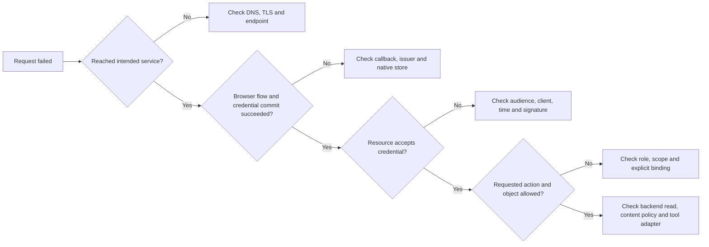

## Find the first failed boundary

“Login failed” can mean the browser never reached Keycloak, the callback failed validation, the OS store rejected persistence, or the resource refused authorization after a successful login. Start with the observed stage and expected contract.

The sequence is a diagnostic aid, not a claim that every service uses the same error format. MCP transport errors, JSON-RPC tool errors, gateway policy errors, and OAuth token-endpoint errors must be interpreted in their own context.

## Symptoms and discriminating evidence

| Symptom | Likely boundary | First useful check |
| --- | --- | --- |
| Browser never opens | Native application/session | Authorization URL presentation and desktop availability |
| Callback rejected | OAuth client | Expected state, issuer, redirect and current attempt |
| Login succeeds but cannot save credentials | OS store | Desktop/keyring session and persistence error category |
| Gateway login saves successfully but the first MCP connection needs sign-in | Gateway-held upstream OAuth | Gateway upstream grant state and IdP refresh error; native credential persistence alone does not prove upstream access |
| MCP login requests unrelated permissions | OAuth scope selection | Gateway scopes from gateway discovery; upstream read scopes belong to the gateway integration |
| Authorization rejects duplicate resource | Discovery/configuration | Check the failing OAuth leg and its discovered resource before adding an explicit override |
| Tools stop after prolonged inactivity | Upstream or inference refresh session | Check the refresh grant and SSO idle limit, not only the gateway access token; renew the affected login |
| MCP works until access-token expiry | OAuth refresh | Granted scopes versus refresh request; affected RMCP added ungranted `offline_access` |
| npm upgrade still runs an old command | Local installation | Resolved executable, npm prefix and legacy PATH symlink |
| MCP 401 | Token validation | Intended resource audience, issuer, client, expiry, signature |
| Gateway MCP 403 | Gateway authorization | CAS identity, directory membership and workspace/integration access |
| `access_denied`: user does not have workspace access | CIE-to-workspace mapping | Existing group mapping, Full Sync and workspace Members tab |
| Browser says complete but CLI login fails | Native persistence | CLI completion and Keychain/Secret Service session |
| Upstream MCP 403 | Resource authorization | Human invoke/read roles, issued scopes and subject binding |
| Generic unavailable object | Object authorization or absent object | Authorized workspace/profile context; do not enumerate foreign IDs |
| Inference succeeds but model never calls MCP | Tool exposure/selection | Actual outbound function definitions and returned call events |
| Direct tool call works but model call fails | Harness/gateway adapter | Namespace mapping, arguments and preserved call ID |
| Backend denies MCP's request | PAN IAM/service credential | HTTP status, operator request UUID, allowlisted IAM code, remaining token lifetime and required read permission |
| SAML succeeds but gateway identity resolution fails | CAS/directory join | NameID, consumed username attribute and directory lookup field |
| CIE membership remains stale | Provisioning/consumer | Last successful reconciliation, warnings and consumer refresh |
| Old token works after logout | Token lifecycle | Token expiry and resource-side binding state |

Never paste a real JWT into a public decoder or issue. A decoded payload is also untrusted until the signature and context checks pass. Capture the comparison result—such as “audience mismatched”—rather than the credential.

Do not repair a failed gateway route by changing the harness destination to the upstream resource. Check the gateway integration, upstream-host allowlist and upstream OAuth callback/client configuration.

The adapter retries an authorized read once after refreshing a cached service token rejected with HTTP 401. It does not retry HTTP 403 or 404. A production diagnostic observed a 403 while the token still had 890 seconds remaining, followed by a successful read. Preserve its request correlation and investigate the denial; a fresh human login or broader service permissions is not an established repair.

An explicit `x-opa-decision: false` is a backend policy denial. Check the service account's tenant, custom role and workspace scope alongside the request's tenant context. The SDK supplies the configured tenant in `x-tsg-id`; a matching header identifies context and does not grant access. Keep this backend decision separate from gateway CAS membership and the upstream human MCP binding.

A completed gateway-facing login can coexist with an expired gateway-held upstream refresh grant. In one observed startup failure, Keycloak reported `Token is not active` when the gateway attempted upstream refresh. A fresh gateway/upstream consent flow restored tool access. Check both OAuth legs before attributing such a failure to the native credential store.

## Browser callbacks when the harness runs remotely

A browser can run on a different computer from the harness, but `127.0.0.1` in the callback always refers to the browser's computer. In the headless Linux acceptance test, an SSH reverse tunnel forwarded the browser computer's loopback callback port to the Linux harness process. The native client, PKCE verifier and credential store stayed on Linux.

Confirm that the tunnel is listening before opening consent, and keep it and the native login process alive until the CLI reports success. The tested native MCP callback expires after five minutes. A browser “cannot connect to localhost” error after that deadline requires a fresh native attempt; reopening an old consent tab cannot revive the listener. Browser completion also needs a successful native credential save, followed by a real tool connection.

## Worked incident: tools disappear

In the historical alpha.13 incident, the user could obtain a model response and a direct MCP probe listed eight tools. That narrows the failure: TLS, basic inference, and basic MCP access work. Inspecting the inference request reveals tool declarations wrapped in a namespace that the gateway path drops. The model therefore has no callable functions.

The inference adapter repair flattens names at the gateway boundary and restores namespaced call events. This historical diagnosis does not prove that MCP transport used the gateway; alpha.14 also needs correlated gateway MCP ingress and upstream requests. Acceptance then verifies a model-selected tool call and its actual result. Adding more Keycloak roles would not repair a missing schema.

## Worked incident: login works, refresh fails

Initial OAuth and tool reads succeeded, but real expiry testing exposed a refresh rejection. RMCP 3.2 added `offline_access` because discovery advertised it, even though the original grant contained only read scopes. Server support for a scope does not grant it to this client. The harness correction retains `offline_access` only when it was actually granted; its HTTP regression test covers both cases and checks the resource parameter. Final concurrent expiry acceptance still belongs to the exact installed release. Adding broader permissions would conceal the defect.

## Worked incident: authenticated identity cannot be found

CAS accepts a SAML assertion, but the gateway cannot resolve a provisioned user. The directory has `alex@example.com`; the consumed assertion field contains `alex`. In the related case study, correcting NameID alone was insufficient because a second `username` attribute was also consumed. Mapping both according to the configured contract resolved the consent step.

That proves identity formatting at that step. It does not prove cross-realm account linking, downstream MCP authorization, or complete end-to-end tool execution. Preserve those as separate checks.

## Worked incident: CIE user exists, workspace access is denied

The native gateway login returned `access_denied` even though the user existed in Keycloak and CIE and belonged to the expected source group. The gateway-provided short connection URL produced the same result. Adding the existing CIE group-to-harness-workspace mapping, running Full Sync and confirming the Members tab repaired this boundary. The next desktop native login and all eight development tool reads succeeded.

The general workspace-detail API still showed an empty `users` field, so it was not a valid substitute for the directory-backed member check. No wider administrator grant, upstream policy relaxation or direct-server bypass was needed.

## A useful incident record

Record time, environment, source/image version, request correlation, failing boundary, sanitized expected/observed values, and the smallest reproducer. Record the post-fix positive and negative outcomes. Exclude tokens, full backend responses, private prompt content, and operational secret locations from public reports.

Continue with [Labs and answer keys](./labs.md). Internal case-study provenance: [Implementation status and public sources](./evidence.md).
