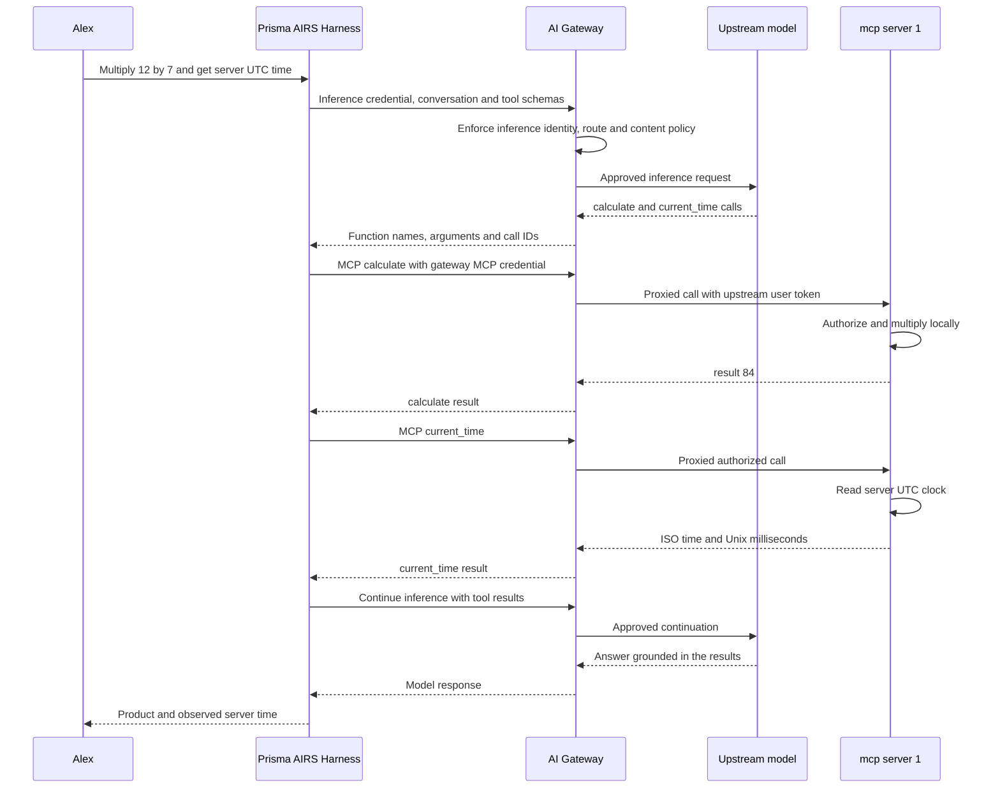

## Follow one utility request

Alex asks:

> Use mcp server 1 to multiply 12 by 7, then give me the server's current UTC time.

The component lessons describe each piece in isolation; this one puts them in motion. The request needs two MCP tools, and the arithmetic is deliberately easy so that the answer is never the interesting part. What matters is who sends each message, where the work happens and which credential authorizes it.

Read the sequence as three exchanges. In the first, the harness sends Alex's question, the conversation and the tool schemas through the inference listener. The gateway enforces identity, routing and content policy before the model sees anything, and the model answers not with a final reply but with two function calls. In the second, the harness sends those calls to the gateway MCP listener with its gateway-facing MCP credential. The gateway presents the upstream user token it holds for Alex, proxies each call to mcp server 1, and the server authorizes the request and does the work itself: it multiplies the numbers and reads its own clock. It does not query another API to obtain either value. In the third, the harness sends the completed results back through the inference listener so the model can write an answer grounded in them.

Notice the division of labor. The model only selects tools; it never speaks MCP. The harness executes the protocol calls. The gateway mediates both request paths, which is why one question can be governed by two different credential contracts.

The diagram shows the two tool calls serially so it stays readable. A model can request independent tools together, subject to the harness's scheduling and permissions. One more caution that matters when you read logs: a returned function call is the model asking for a tool, not proof that the tool ran. The evidence that it ran is the completed tool event and its result.

## Read the answer against the evidence

A sound answer says that the product is 84 and reports the timestamp returned by `current_time`. It identifies that timestamp as the MCP server's clock at execution time. It does not claim to have measured the user's laptop clock or an external time service, because neither was consulted.

One successful request shows that the utility path worked for that request: login, gateway access, upstream authorization, argument validation and local execution all held. It does not show the gateway configuration, the contents of the security profile or a scanner verdict. Those are separate observations with their own evidence.

## What if one step fails?

Because the request crosses several boundaries, it can fail at several of them, and the useful behavior differs at each one.

| Failure | What the harness should communicate |
| --- | --- |
| Inference sign-in can no longer renew | Offer company sign-in and preserve the conversation |
| Gateway MCP access needs consent | Identify the affected MCP connection and guide its login |
| Utility arguments are invalid | Show the tool error; correct arguments only when the user's intent supports it |
| One tool succeeds and another fails | Preserve the completed result and report the failed operation accurately |
| A new MCP login cannot prove identity continuity | Require a fresh conversation; do not replay completed tools automatically |

The pattern behind the table is that the harness should say which boundary failed and keep what already succeeded. The one exception is a new MCP login that cannot prove it belongs to the same identity: replaying completed tools under an unverified identity would be a guess, so the harness requires a fresh conversation instead.

The 30-minute idle policy and the recovery behavior are covered in [Credential lifecycle](./lifecycle.md). Practice this trace in the [labs](./labs.md).
