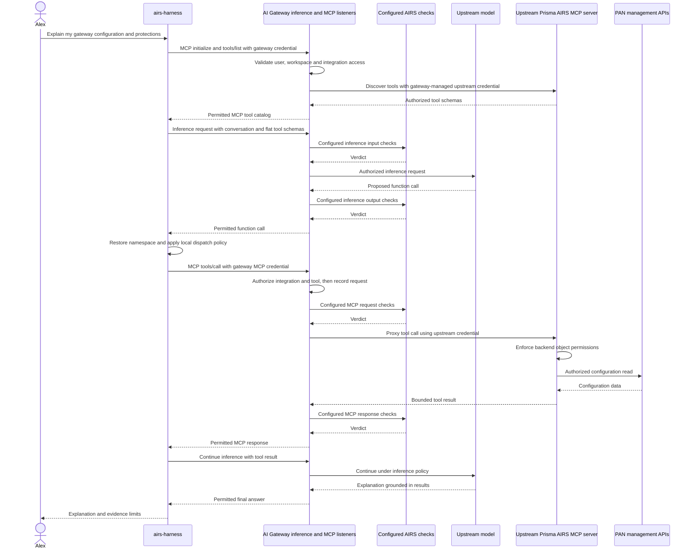

## One question, two gateway listeners

> Which gateway configuration can I use, and what security protections are attached to it?

The required path sends inference and actual MCP protocol calls through AI Gateway. Assume the user has gateway access, the upstream integration is provisioned to the workspace, and its required upstream OAuth consent is complete. These are prerequisites to test, not established results from the earlier direct-path experiment.

The scanner arrows identify where configured controls belong. Their presence in a diagram does not prove a particular rule or structured field is scanned. Acceptance must verify the actual policies and verdicts attached to both request paths. Subsequent inference exchanges abbreviate the same configured enforcement shown on the first exchange.

## What proves the route

| Evidence | Required observation |
| --- | --- |
| Harness destinations | Inference and MCP listener URLs belong to the approved AI Gateway deployment |
| MCP request | Gateway receives initialize, tools/list and tools/call |
| Upstream request | Gateway initiates the connection and supplies upstream authentication |
| Credentials | Harness holds gateway credentials; upstream OAuth tokens remain gateway-managed |
| Denial | Gateway rejects an unauthorized integration/tool without a successful upstream operation |
| Lifecycle | Gateway-facing and upstream token renewal work independently |
| Final answer | Model used actual returned tool results |

Reading a security profile proves configuration visibility, not execution of its protections. A direct MCP probe proves upstream reachability, not gateway mediation. A model response without a tool event does not prove configuration inspection.

Continue with [Implementation status and public sources](./evidence.md). The labs now exercise this required path. Their instructions are learning exercises, not completed deployment acceptance.
