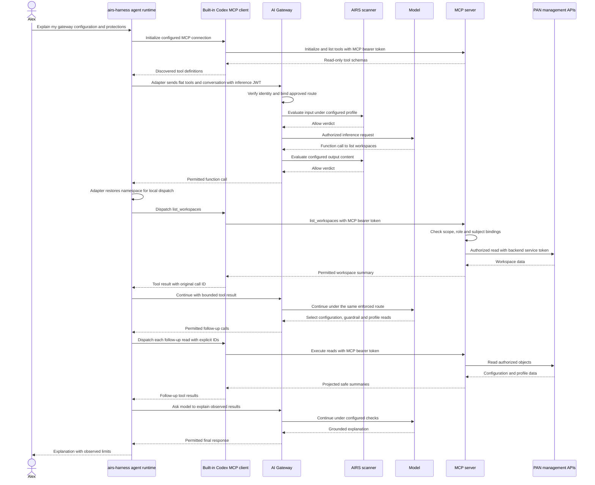

## Alex asks for an explanation, not a configuration change

> Which gateway configuration can I use, and what security protections are attached to it?

Assume Alex has completed both native logins, holds the two read scopes, and is bound to one learning workspace and one profile. Those prerequisites matter: the same words from an unassigned user must not produce the same inventory.

Later inference exchanges abbreviate the same configured input/output checks shown on the first exchange. The diagram illustrates one possible sequence, not a deterministic promise about the model's choice or ordering of tools. The scanner arrows describe configured content evaluation, not an assertion that every structured field has separate scanner coverage.

The agent runtime and built-in MCP client lifelines are parts of the same executable. The MCP server lifeline is a remote service. Only inference requests and returned tool results pass through the gateway; MCP protocol calls and the MCP bearer token go directly to the resource server.

## Read the evidence at each step

| Stage | What was established | What was not established |
| --- | --- | --- |
| Native login | A verified identity and resource-bound tokens | Access to every workspace |
| Gateway admission | This inference request satisfies identity/routing policy | MCP object authorization |
| Tool selection | The model requested a function with arguments | Permission to execute it |
| MCP authorization | This user may read this object with this tool | Permission to mutate it |
| Backend read | The server account could retrieve the object | Permission to expose raw JSON |
| Safe projection | Only allowed summary fields returned | Runtime proof that all protections executed |
| Final answer | Model explanation based on returned observations | A configuration change or compliance certification |

An appropriate answer could say that the permitted route has an input and output AIRS guardrail, name the returned protection actions, and identify information the tools do not expose. It should not invent hidden settings or claim that reading a profile exercised its policies.

## Add a denial to the story

Now Alex asks about `workspace-finance`, which is outside the binding. The model may still generate a syntactically correct tool call. The MCP server returns its generic unavailable-object result. The harness should present the limitation or continue with permitted information. Retrying with the inference token, requesting a broad backend credential, or guessing IDs does not fix authorization.

## Where CIE affects this story

For this implemented native route, direct token issuance and MCP authorization do not require a CIE round trip. In a gateway identity route that consumes CIE, provisioning and identity resolution become prerequisites before the gateway admits the user. That is the extension described in [Cloud Identity Engine and provisioning](./cie.md), and it needs its own acceptance before being added as a solid arrow here.

**Checkpoint:** if the model answers from memory without any tool calls, the user may receive plausible prose, but the run has not demonstrated configuration inspection. Acceptance must check the tool events and their results.

Implementation basis: [Implementation status and public sources](./evidence.md). Practice this flow in [Labs and answer keys](./labs.md).
